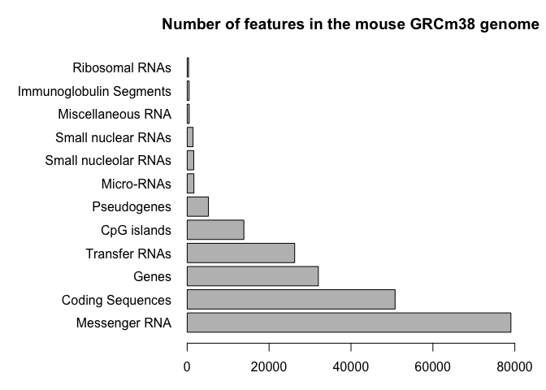

Class 5: Data Visualization with R
================
Serina Huang
12/04/18

2A. Line plot
-------------

``` r
par(mar = c(5.1,4.1,4.1,2.1))
par( mfrow=c(1,1) )

# input baby weight data
weight <- read.table("bimm143_05_rstats/weight_chart.txt", header=TRUE)
plot(weight, type="o", pch=15, cex=1.5, lwd=2, ylim=c(2,10),
     xlab="Age (months)", ylab="Weight (kg)", main="Baby weight with age")
```


2B. Barplot
-----------

``` r
# adjust margins; par()$mar tells you current settings
# dev.off can turn off global par settings
par(mar = c(3,12,3,2))

# input feature counts of mouse genome data
counts <- read.table("bimm143_05_rstats/feature_counts.txt", header=TRUE, sep="\t")
barplot(counts$Count, horiz=TRUE, names.arg=counts[,1], main="Number of features in the mouse GRCm38 genome",
        las=1, xlim=c(0,80000))
```



2C. Histograms
--------------

``` r
hist(c(rnorm(10000),c(rnorm(10000)+4)), breaks=50, col=c("red2","pink2","white"), main="Histogram")
```


3A. Providing color vectors
---------------------------

``` r
plot(c(1:10), c(20:29), cex=1, pch=1:4, col=c("red","blue","green"))
```


``` r
# when is this recycling an advantage? Grouped or stacked bar chart
# can also use in cbind to match vectors of different lengths
vec1 = c(1:2)
vec2 = c(1:8)
cbind(vec1, vec2)
```

    ##      vec1 vec2
    ## [1,]    1    1
    ## [2,]    2    2
    ## [3,]    1    3
    ## [4,]    2    4
    ## [5,]    1    5
    ## [6,]    2    6
    ## [7,]    1    7
    ## [8,]    2    8

``` r
# restore margin defaults
par(mar = c(5.1,4.1,4.1,2.1))


# multi-panel plot of 2 rows and 2 columns
# recycling used here too (each action adds/replaces a blank)
par( mfrow=c(2,2) )
plot(2:3)
plot(4:6)
plot(3:60, type="l", col="purple")
plot(42:45, type="b", col="orange")
```


``` r
plot(4:9, type="o", pch=12, col=c("pink","blue","purple"))

# reset multi-panel
par( mfrow=c(1,1) )
```


``` r
mf <- read.table("bimm143_05_rstats/male_female_counts.txt", header=TRUE, sep="\t")
col_vector <- rainbow(nrow(mf))
barplot(mf$Count, names.arg=mf$Sample, col=c("purple4","orange3"), las=3)
```


3B. Coloring by value
=====================

``` r
genes <- read.delim("bimm143_05_rstats/up_down_expression.txt")
# how many genes are there?
nrow(genes)
```

    ## [1] 5196

``` r
# what are the states?
levels(genes$State)
```

    ## [1] "down"       "unchanging" "up"

``` r
# table function tabulates how many genes are in each state
table(genes$State)
```

    ## 
    ##       down unchanging         up 
    ##         72       4997        127

``` r
plot(genes$Condition1, genes$Condition2, xlab="Expression condition 1", ylab="Expression condition 2", col=genes$State)
```


``` r
palette(c("blue","gray","red"))
```

3C. Dynamic use of color
========================

``` r
meth = read.delim("bimm143_05_rstats/expression_methylation.txt")
nrow(meth)
```

    ## [1] 9241

``` r
plot(meth$gene.meth, meth$expression, pch=20)
```


``` r
my_colors <- densCols(meth$gene.meth, meth$expression)
plot(meth$gene.meth, meth$expression, pch=20, col=my_colors)
```


``` r
# restrict to plot points whose expression > 0
inds <- meth$expression > 0
my_colors2 <- densCols(meth$gene.meth[inds], meth$expression[inds])
plot(meth$gene.meth[inds], meth$expression[inds], pch=20, col=my_colors2)
```


``` r
# instead of a blue gradient, change to higher contrast colors
my_colors3 <- densCols(meth$gene.meth[inds], meth$expression[inds], colramp=colorRampPalette(c("blue","green", "red", "yellow")))
plot(meth$gene.meth[inds], meth$expression[inds], pch=20, col=my_colors3)
```


