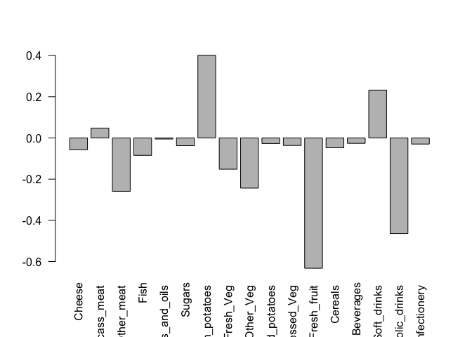
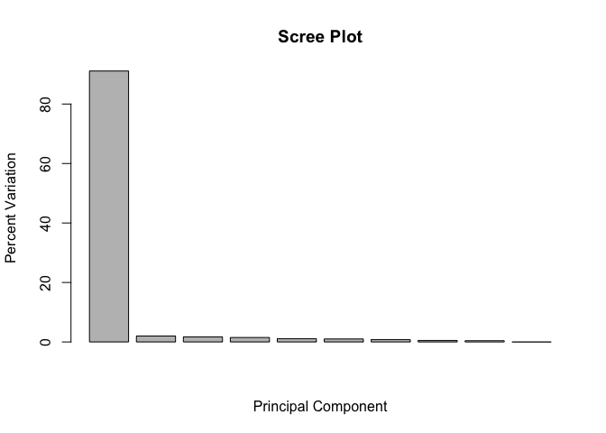
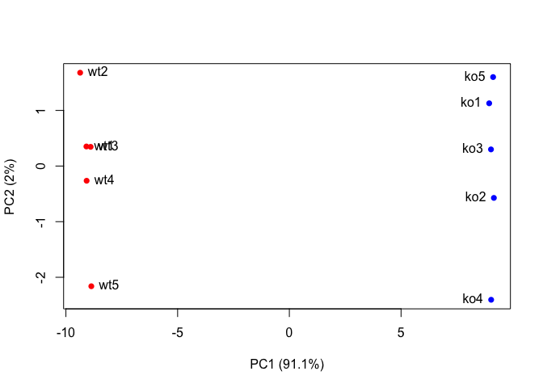

Lab 8
================
Serina Huang
October 25, 2018

Section 1. PCA of UK food data
------------------------------

``` r
x <- read.csv("https://bioboot.github.io/bimm143_F18/class-material/UK_foods.csv")
dim(x)
```

    ## [1] 17  5

Let's check out the data:

``` r
head(x)
```

    ##                X England Wales Scotland N.Ireland
    ## 1         Cheese     105   103      103        66
    ## 2  Carcass_meat      245   227      242       267
    ## 3    Other_meat      685   803      750       586
    ## 4           Fish     147   160      122        93
    ## 5 Fats_and_oils      193   235      184       209
    ## 6         Sugars     156   175      147       139

Fix the data so each country gets one column:

``` r
rownames(x) <- x[,1]
x <- x[,-1]
head(x)
```

    ##                England Wales Scotland N.Ireland
    ## Cheese             105   103      103        66
    ## Carcass_meat       245   227      242       267
    ## Other_meat         685   803      750       586
    ## Fish               147   160      122        93
    ## Fats_and_oils      193   235      184       209
    ## Sugars             156   175      147       139

``` r
dim(x)
```

    ## [1] 17  4

Generate a table:

``` r
knitr::kable(x, caption = "The full UK foods data table")
```

|                     |  England|  Wales|  Scotland|  N.Ireland|
|---------------------|--------:|------:|---------:|----------:|
| Cheese              |      105|    103|       103|         66|
| Carcass\_meat       |      245|    227|       242|        267|
| Other\_meat         |      685|    803|       750|        586|
| Fish                |      147|    160|       122|         93|
| Fats\_and\_oils     |      193|    235|       184|        209|
| Sugars              |      156|    175|       147|        139|
| Fresh\_potatoes     |      720|    874|       566|       1033|
| Fresh\_Veg          |      253|    265|       171|        143|
| Other\_Veg          |      488|    570|       418|        355|
| Processed\_potatoes |      198|    203|       220|        187|
| Processed\_Veg      |      360|    365|       337|        334|
| Fresh\_fruit        |     1102|   1137|       957|        674|
| Cereals             |     1472|   1582|      1462|       1494|
| Beverages           |       57|     73|        53|         47|
| Soft\_drinks        |     1374|   1256|      1572|       1506|
| Alcoholic\_drinks   |      375|    475|       458|        135|
| Confectionery       |       54|     64|        62|         41|

Can you extract any useful information from this table? I thought not. Let's try representing it in a heatmap.

``` r
heatmap(as.matrix(x))
```


What are the relationships between the variables (types of food)? You can't do it without PCA. Now, we need to transpose our matrix because the `prcomp()` function takes observations in rows and variables in columns.

``` r
pca <- prcomp( t(x) )
summary(pca)
```

    ## Importance of components:
    ##                             PC1      PC2      PC3       PC4
    ## Standard deviation     324.1502 212.7478 73.87622 4.189e-14
    ## Proportion of Variance   0.6744   0.2905  0.03503 0.000e+00
    ## Cumulative Proportion    0.6744   0.9650  1.00000 1.000e+00

Which PC has the maximum variance? The summary shows that PC1 captures 67% of variance and PC2 captures 29%, for a total of 96%. Usually, 70% is good 'nuff.

``` r
plot(pca$x[,1], pca$x[,2], xlab = "PC1", ylab = "PC2", xlim = c(-270, 500))

text(pca$x[,1], pca$x[,2], colnames(x))
```


There are two ways to find the variance of each PC. First, we can calculate it ourselves by squaring the standard deviation:

``` r
v <- round( pca$sdev^2 / sum(pca$sdev^2) * 100 )
v
```

    ## [1] 67 29  4  0

Second, we can use the `summary` as we've done previously.

``` r
z <- summary(pca)
z$importance
```

    ##                              PC1       PC2      PC3          PC4
    ## Standard deviation     324.15019 212.74780 73.87622 4.188568e-14
    ## Proportion of Variance   0.67444   0.29052  0.03503 0.000000e+00
    ## Cumulative Proportion    0.67444   0.96497  1.00000 1.000000e+00

Represent the summary in a scree plot:

``` r
barplot(v, xlab = "Principal Component", ylab = "Percent Variation")
```


We can also find the cumulative sum of the variance.

``` r
cumsum(v)
```

    ## [1]  67  96 100 100

Let's look at the loading score of each observation in PC1.

``` r
# Perpendicular labels
barplot( pca$rotation[,1], las = 2)
```



How to interpret: fresh potatoes (most positive) is the observation that pushes N. Ireland to the right side of the plot. Fresh fruit (most negative) is the observation that pushes Wales, England, and Scotland to the left side of the plot.

We can see the same information with biplot.

``` r
biplot(pca)
```


Section 2. PCA of example RNA-seq data
--------------------------------------

``` r
data.matrix <- matrix(nrow=100, ncol=10)
# Label rows with gene names
rownames(data.matrix) <- paste0("gene", 1:100)
# Label columns with sample cells
colnames(data.matrix) <- c(
  paste0("wt", 1:5),
  paste0("ko", 1:5)
)

head(data.matrix)
```

    ##       wt1 wt2 wt3 wt4 wt5 ko1 ko2 ko3 ko4 ko5
    ## gene1  NA  NA  NA  NA  NA  NA  NA  NA  NA  NA
    ## gene2  NA  NA  NA  NA  NA  NA  NA  NA  NA  NA
    ## gene3  NA  NA  NA  NA  NA  NA  NA  NA  NA  NA
    ## gene4  NA  NA  NA  NA  NA  NA  NA  NA  NA  NA
    ## gene5  NA  NA  NA  NA  NA  NA  NA  NA  NA  NA
    ## gene6  NA  NA  NA  NA  NA  NA  NA  NA  NA  NA

``` r
# Fill in fake read counts
for (i in 1:100) {
  wt.values <- rpois(5, lambda = sample(x = 10:1000, size = 1))
  ko.values <- rpois(5, lambda = sample(x = 10:1000, size = 1))
  
  data.matrix[i,] <- c(wt.values, ko.values)
}

head(data.matrix)
```

    ##       wt1 wt2 wt3 wt4 wt5 ko1  ko2  ko3  ko4  ko5
    ## gene1  21  21  23  19  22 879  868  826  929  807
    ## gene2 143 159 173 144 177 177  192  176  190  171
    ## gene3 904 936 944 934 921 346  313  338  306  326
    ## gene4 931 903 894 889 895 592  636  637  606  571
    ## gene5 100 104  85 112  84 618  605  621  609  635
    ## gene6 152 164 156 138 165 954 1046 1027 1013 1006

It's PCA time!

``` r
pca <- prcomp( t(data.matrix), scale = TRUE)
plot(pca$x[,1], pca$x[,2])
```


``` r
# Variance captured per PC
pca.var <- pca$sdev^2
# Convert variance into percent variance (1 decimal point)
pca.var.per <- round(pca.var / sum(pca.var) * 100, 1)
pca.var.per
```

    ##  [1] 91.1  2.0  1.7  1.5  1.1  1.0  0.8  0.5  0.4  0.0

``` r
# Use this to generate scree plot
barplot(pca.var.per, main = "Scree Plot", xlab = "Principal Component", ylab = "Percent Variation")
```



Color code our PCA plot:

``` r
# Make a color vector for wt and ko samples
colvec <- colnames(data.matrix)
colvec[grep("wt", colvec)] <- "red"
colvec[grep("ko", colvec)] <- "blue"

plot(pca$x[,1], pca$x[,2], col = colvec, pch = 16,
     xlab = paste0("PC1 (", pca.var.per[1], "%)"),
     ylab = paste0("PC2 (", pca.var.per[2], "%)"))

# Label samples to the right of the first five points, and to the left of the last five points
text( pca$x[,1], pca$x[,2], labels = colnames(data.matrix), pos = c(rep(4,5), rep(2,5)) )
```



Let's look at the loading scores of each gene (observation) in PC1.

``` r
loading_scores <- pca$rotation[,1]
# Since we're interested in effect magnitude, use absolute value of loading scores. Then rank them.
gene_scores <- abs(loading_scores)
gene_score_ranked <- sort(gene_scores, decreasing = TRUE)

# Get the name of the top 10 genes
top_10_genes <- names(gene_score_ranked[1:10])
top_10_genes
```

    ##  [1] "gene52" "gene64" "gene77" "gene74" "gene45" "gene24" "gene3" 
    ##  [8] "gene5"  "gene54" "gene15"

Section 3. PCA of protein structure data
----------------------------------------
