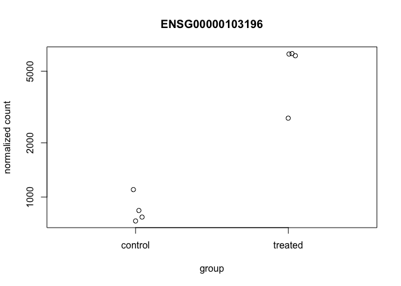
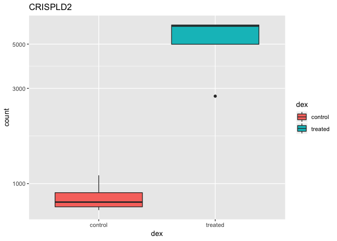
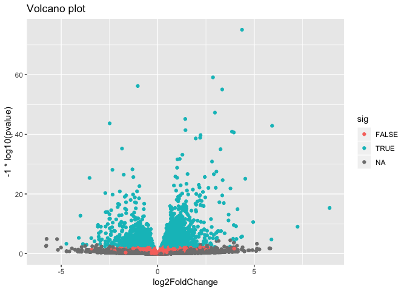
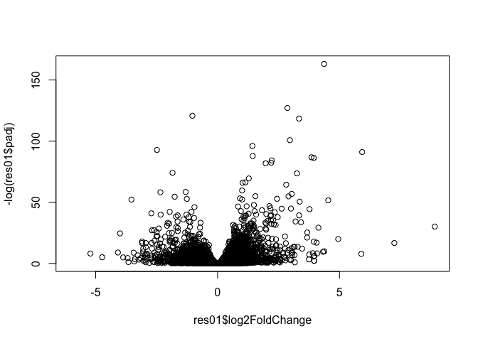
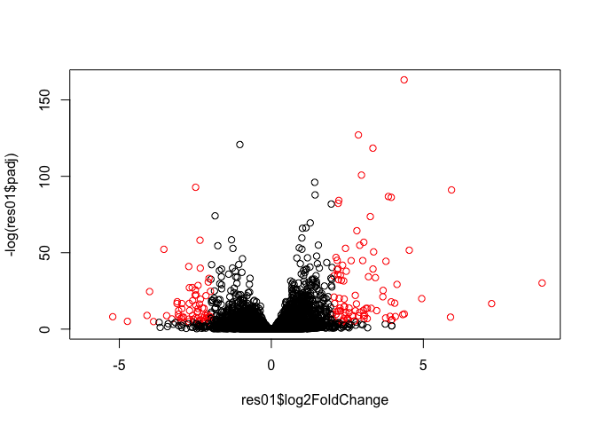

Class 15: Genome Informatics II
================
Serina Huang
11/23/18

Transcriptomics and RNA-seq Analysis
------------------------------------

``` r
# source("http://bioconductor/org/biocLite.R")
# biocLite()
# biocLite("DESeq2")
# library(BiocInstaller)

# stringsAsFactors reads a logical. If true, charater vectors will be converted to factors
counts <- read.csv("https://bioboot.github.io/bimm143_W18/class-material/airway_scaledcounts.csv", stringsAsFactors = FALSE)
metadata <- read.csv("https://bioboot.github.io/bimm143_W18/class-material/airway_metadata.csv", stringsAsFactors = FALSE)

head(counts)
```

    ##           ensgene SRR1039508 SRR1039509 SRR1039512 SRR1039513 SRR1039516
    ## 1 ENSG00000000003        723        486        904        445       1170
    ## 2 ENSG00000000005          0          0          0          0          0
    ## 3 ENSG00000000419        467        523        616        371        582
    ## 4 ENSG00000000457        347        258        364        237        318
    ## 5 ENSG00000000460         96         81         73         66        118
    ## 6 ENSG00000000938          0          0          1          0          2
    ##   SRR1039517 SRR1039520 SRR1039521
    ## 1       1097        806        604
    ## 2          0          0          0
    ## 3        781        417        509
    ## 4        447        330        324
    ## 5         94        102         74
    ## 6          0          0          0

``` r
head(metadata)
```

    ##           id     dex celltype     geo_id
    ## 1 SRR1039508 control   N61311 GSM1275862
    ## 2 SRR1039509 treated   N61311 GSM1275863
    ## 3 SRR1039512 control  N052611 GSM1275866
    ## 4 SRR1039513 treated  N052611 GSM1275867
    ## 5 SRR1039516 control  N080611 GSM1275870
    ## 6 SRR1039517 treated  N080611 GSM1275871

### Rudimentary Differential Gene Expression Analysis

Let's examine the metadata file to find **control** and **treated** columns. Then, compute the mean counts per gene for the each treatment.

``` r
# Find control samples in metadata
control_ind <- metadata$dex == "control"
# Narrow down metadata to only control samples
control <- metadata[control_ind,]

# Compute mean of each gene for control samples
control.mean <- rowSums(counts[,control$id]) / nrow(control)
# Assign gene ID to each mean gene count
names(control.mean) <- counts$ensgene
```

Do the same thing for the treated columns:

``` r
# Find treated samples in metadata
treated_ind <- metadata$dex == "treated"
treated <- metadata[treated_ind,]

# Compute mean counts per gene across all the treated samples
treated.mean <- rowSums(counts[,treated$id]) / nrow(treated)
head(treated.mean)
```

    ## [1] 658.00   0.00 546.00 316.50  78.75   0.00

``` r
# Assign gene ID to each mean gene count
names(treated.mean) <- counts$ensgene
head(treated.mean)
```

    ## ENSG00000000003 ENSG00000000005 ENSG00000000419 ENSG00000000457 
    ##          658.00            0.00          546.00          316.50 
    ## ENSG00000000460 ENSG00000000938 
    ##           78.75            0.00

``` r
# Combine control and treated mean count data
meancounts <- data.frame(control.mean, treated.mean)
head(meancounts)
```

    ##                 control.mean treated.mean
    ## ENSG00000000003       900.75       658.00
    ## ENSG00000000005         0.00         0.00
    ## ENSG00000000419       520.50       546.00
    ## ENSG00000000457       339.75       316.50
    ## ENSG00000000460        97.25        78.75
    ## ENSG00000000938         0.75         0.00

``` r
colSums(meancounts)
```

    ## control.mean treated.mean 
    ##     23005324     22196524

There seems to be differential gene expression between the control and treated groups. However, this is a rudimentary analysis because we did not account for sequencing depth. I.e. the number of reads generated from a sample in a given experiment varies. The deeper the sample is sequenced, the more transcripts are identified, and the higher the expression level.

Let's plot this result before moving on to the real differental gene analysis.

``` r
plot(meancounts$control.mean, meancounts$treated.mean, xlab = "Control", ylab = "Treated")
```


Each point is a gene. The points off the diagonal are the genes with differential expression. There is a lot of data with low counts off the diagonal but they are covering up each other, so let's plot the same data on a log scale.

``` r
plot(meancounts$control.mean, meancounts$treated.mean, log = "xy", xlab = "log Control", ylab = "log Treated")
```

    ## Warning in xy.coords(x, y, xlabel, ylabel, log): 15032 x values <= 0
    ## omitted from logarithmic plot

    ## Warning in xy.coords(x, y, xlabel, ylabel, log): 15281 y values <= 0
    ## omitted from logarithmic plot


We usually quantify this difference using log<sub>2</sub> fold change since **doubling** is either to understand.

``` r
# Compute log2 fold change and add the results to our dataframe
meancounts$log2fc <- log2(meancounts[,"treated.mean"] / meancounts[,"control.mean"])
head(meancounts)
```

    ##                 control.mean treated.mean      log2fc
    ## ENSG00000000003       900.75       658.00 -0.45303916
    ## ENSG00000000005         0.00         0.00         NaN
    ## ENSG00000000419       520.50       546.00  0.06900279
    ## ENSG00000000457       339.75       316.50 -0.10226805
    ## ENSG00000000460        97.25        78.75 -0.30441833
    ## ENSG00000000938         0.75         0.00        -Inf

We get NaN if we divide by 0 (i.e. the control has 0 mean gene expression for a particular gene) and try to take the log. We get -Inf if we take the log of 0 (i.e. the treated has 0 mean gene expression for a particular gene).

Let's filter out the genes with zero expression.

``` r
# For each gene, determine if the mean count is 0
# Do so for both control and treated samples
x <- meancounts[,1:2] == 0
head(x)
```

    ##                 control.mean treated.mean
    ## ENSG00000000003        FALSE        FALSE
    ## ENSG00000000005         TRUE         TRUE
    ## ENSG00000000419        FALSE        FALSE
    ## ENSG00000000457        FALSE        FALSE
    ## ENSG00000000460        FALSE        FALSE
    ## ENSG00000000938        FALSE         TRUE

``` r
# Identify the index of each gene for which BOTH control and treated samples are 0 
zero.vals <- which(x, arr.ind = TRUE)
head(zero.vals)
```

    ##                 row col
    ## ENSG00000000005   2   1
    ## ENSG00000004848  65   1
    ## ENSG00000004948  70   1
    ## ENSG00000005001  73   1
    ## ENSG00000006059 121   1
    ## ENSG00000006071 123   1

``` r
# Store the indices of the genes that we want to remove
to.rm <- unique(zero.vals[,1])
# The negative sign means: remove this index from the array
mycounts <- meancounts[-to.rm,]
head(mycounts)
```

    ##                 control.mean treated.mean      log2fc
    ## ENSG00000000003       900.75       658.00 -0.45303916
    ## ENSG00000000419       520.50       546.00  0.06900279
    ## ENSG00000000457       339.75       316.50 -0.10226805
    ## ENSG00000000460        97.25        78.75 -0.30441833
    ## ENSG00000000971      5219.00      6687.50  0.35769358
    ## ENSG00000001036      2327.00      1785.75 -0.38194109

``` r
# Now we can see which genes are upregulated or downregulated
up.ind <- mycounts$log2fc > 2
down.ind <- mycounts$log2fc < (-2)

# How many genes are upregulated or downregulated?
sum(up.ind)
```

    ## [1] 250

``` r
sum(down.ind)
```

    ## [1] 367

``` r
# How many genes in total have differential expression between control and treated groups?
sum(up.ind) + sum(down.ind)
```

    ## [1] 617

Annotate our genes so we know what genes were have and might be doing.

``` r
anno <- read.csv("https://bioboot.github.io/bimm143_W18/class-material/annotables_grch38.csv")
head(anno)
```

    ##           ensgene entrez   symbol chr     start       end strand
    ## 1 ENSG00000000003   7105   TSPAN6   X 100627109 100639991     -1
    ## 2 ENSG00000000005  64102     TNMD   X 100584802 100599885      1
    ## 3 ENSG00000000419   8813     DPM1  20  50934867  50958555     -1
    ## 4 ENSG00000000457  57147    SCYL3   1 169849631 169894267     -1
    ## 5 ENSG00000000460  55732 C1orf112   1 169662007 169854080      1
    ## 6 ENSG00000000938   2268      FGR   1  27612064  27635277     -1
    ##          biotype
    ## 1 protein_coding
    ## 2 protein_coding
    ## 3 protein_coding
    ## 4 protein_coding
    ## 5 protein_coding
    ## 6 protein_coding
    ##                                                                                                  description
    ## 1                                                          tetraspanin 6 [Source:HGNC Symbol;Acc:HGNC:11858]
    ## 2                                                            tenomodulin [Source:HGNC Symbol;Acc:HGNC:17757]
    ## 3 dolichyl-phosphate mannosyltransferase polypeptide 1, catalytic subunit [Source:HGNC Symbol;Acc:HGNC:3005]
    ## 4                                               SCY1-like, kinase-like 3 [Source:HGNC Symbol;Acc:HGNC:19285]
    ## 5                                    chromosome 1 open reading frame 112 [Source:HGNC Symbol;Acc:HGNC:25565]
    ## 6                          FGR proto-oncogene, Src family tyrosine kinase [Source:HGNC Symbol;Acc:HGNC:3697]

Let's use the `merge()` function to add the annotation data to our our `mycounts` data frame.

``` r
# by.x = column name in x to merge on
# by.y = column name in y to merge on
# All data frames have a row.names attribute
mycounts.anno <- merge(mycounts, anno, by.x = "row.names", by.y = "ensgene")
head(mycounts.anno)
```

    ##         Row.names control.mean treated.mean      log2fc entrez   symbol
    ## 1 ENSG00000000003       900.75       658.00 -0.45303916   7105   TSPAN6
    ## 2 ENSG00000000419       520.50       546.00  0.06900279   8813     DPM1
    ## 3 ENSG00000000457       339.75       316.50 -0.10226805  57147    SCYL3
    ## 4 ENSG00000000460        97.25        78.75 -0.30441833  55732 C1orf112
    ## 5 ENSG00000000971      5219.00      6687.50  0.35769358   3075      CFH
    ## 6 ENSG00000001036      2327.00      1785.75 -0.38194109   2519    FUCA2
    ##   chr     start       end strand        biotype
    ## 1   X 100627109 100639991     -1 protein_coding
    ## 2  20  50934867  50958555     -1 protein_coding
    ## 3   1 169849631 169894267     -1 protein_coding
    ## 4   1 169662007 169854080      1 protein_coding
    ## 5   1 196651878 196747504      1 protein_coding
    ## 6   6 143494811 143511690     -1 protein_coding
    ##                                                                                                  description
    ## 1                                                          tetraspanin 6 [Source:HGNC Symbol;Acc:HGNC:11858]
    ## 2 dolichyl-phosphate mannosyltransferase polypeptide 1, catalytic subunit [Source:HGNC Symbol;Acc:HGNC:3005]
    ## 3                                               SCY1-like, kinase-like 3 [Source:HGNC Symbol;Acc:HGNC:19285]
    ## 4                                    chromosome 1 open reading frame 112 [Source:HGNC Symbol;Acc:HGNC:25565]
    ## 5                                                     complement factor H [Source:HGNC Symbol;Acc:HGNC:4883]
    ## 6                                          fucosidase, alpha-L- 2, plasma [Source:HGNC Symbol;Acc:HGNC:4008]

However, if you don't have an annotation file, you can use the following Bioconductor package:

``` r
library(AnnotationDbi)
```

    ## Loading required package: stats4

    ## Loading required package: BiocGenerics

    ## Loading required package: parallel

    ## 
    ## Attaching package: 'BiocGenerics'

    ## The following objects are masked from 'package:parallel':
    ## 
    ##     clusterApply, clusterApplyLB, clusterCall, clusterEvalQ,
    ##     clusterExport, clusterMap, parApply, parCapply, parLapply,
    ##     parLapplyLB, parRapply, parSapply, parSapplyLB

    ## The following objects are masked from 'package:stats':
    ## 
    ##     IQR, mad, sd, var, xtabs

    ## The following objects are masked from 'package:base':
    ## 
    ##     anyDuplicated, append, as.data.frame, basename, cbind,
    ##     colMeans, colnames, colSums, dirname, do.call, duplicated,
    ##     eval, evalq, Filter, Find, get, grep, grepl, intersect,
    ##     is.unsorted, lapply, lengths, Map, mapply, match, mget, order,
    ##     paste, pmax, pmax.int, pmin, pmin.int, Position, rank, rbind,
    ##     Reduce, rowMeans, rownames, rowSums, sapply, setdiff, sort,
    ##     table, tapply, union, unique, unsplit, which, which.max,
    ##     which.min

    ## Loading required package: Biobase

    ## Welcome to Bioconductor
    ## 
    ##     Vignettes contain introductory material; view with
    ##     'browseVignettes()'. To cite Bioconductor, see
    ##     'citation("Biobase")', and for packages 'citation("pkgname")'.

    ## Loading required package: IRanges

    ## Loading required package: S4Vectors

    ## 
    ## Attaching package: 'S4Vectors'

    ## The following object is masked from 'package:base':
    ## 
    ##     expand.grid

``` r
library(org.Hs.eg.db)
```

    ## 

``` r
# See all available keytypes
columns(org.Hs.eg.db)
```

    ##  [1] "ACCNUM"       "ALIAS"        "ENSEMBL"      "ENSEMBLPROT" 
    ##  [5] "ENSEMBLTRANS" "ENTREZID"     "ENZYME"       "EVIDENCE"    
    ##  [9] "EVIDENCEALL"  "GENENAME"     "GO"           "GOALL"       
    ## [13] "IPI"          "MAP"          "OMIM"         "ONTOLOGY"    
    ## [17] "ONTOLOGYALL"  "PATH"         "PFAM"         "PMID"        
    ## [21] "PROSITE"      "REFSEQ"       "SYMBOL"       "UCSCKG"      
    ## [25] "UNIGENE"      "UNIPROT"

The `multiVals` argument tells the function what to do if there are multiple possible values for a single input value. Here, we ask for the first one that occurs in the database.

``` r
# Another way to do the same thing
mycounts$symbol <- mapIds(org.Hs.eg.db,
                     keys = row.names(mycounts),
                     column = "SYMBOL",
                     keytype = "ENSEMBL",
                     multiVals = "first")
```

    ## 'select()' returned 1:many mapping between keys and columns

``` r
head(mycounts)
```

    ##                 control.mean treated.mean      log2fc   symbol
    ## ENSG00000000003       900.75       658.00 -0.45303916   TSPAN6
    ## ENSG00000000419       520.50       546.00  0.06900279     DPM1
    ## ENSG00000000457       339.75       316.50 -0.10226805    SCYL3
    ## ENSG00000000460        97.25        78.75 -0.30441833 C1orf112
    ## ENSG00000000971      5219.00      6687.50  0.35769358      CFH
    ## ENSG00000001036      2327.00      1785.75 -0.38194109    FUCA2

``` r
mycounts$entrez <- mapIds(org.Hs.eg.db,
                      keys = row.names(mycounts),
                      column = "ENTREZID",
                      keytype = "ENSEMBL",
                      multiVals = "first")
```

    ## 'select()' returned 1:many mapping between keys and columns

``` r
mycounts$uniprot <- mapIds(org.Hs.eg.db,
                      keys = row.names(mycounts),
                      column = "UNIPROT",
                      keytype = "ENSEMBL",
                      multiVals = "first")
```

    ## 'select()' returned 1:many mapping between keys and columns

``` r
View(mycounts)
```

### DESeq2 Analysis

``` r
library(DESeq2) 
```

    ## Loading required package: GenomicRanges

    ## Loading required package: GenomeInfoDb

    ## Loading required package: SummarizedExperiment

    ## Loading required package: DelayedArray

    ## Loading required package: matrixStats

    ## 
    ## Attaching package: 'matrixStats'

    ## The following objects are masked from 'package:Biobase':
    ## 
    ##     anyMissing, rowMedians

    ## Loading required package: BiocParallel

    ## 
    ## Attaching package: 'DelayedArray'

    ## The following objects are masked from 'package:matrixStats':
    ## 
    ##     colMaxs, colMins, colRanges, rowMaxs, rowMins, rowRanges

    ## The following objects are masked from 'package:base':
    ## 
    ##     aperm, apply

``` r
dds <- DESeqDataSetFromMatrix(countData = counts,
                              colData = metadata,
                              design =~ dex,
                              tidy = TRUE)
```

    ## converting counts to integer mode

    ## Warning in DESeqDataSet(se, design = design, ignoreRank): some variables in
    ## design formula are characters, converting to factors

``` r
# The DESeq function normalizes library size by estimating "size factors", estimates dispersion for the negative binomial model, and fits models and gets statistics for each gene
dds <- DESeq(dds)
```

    ## estimating size factors

    ## estimating dispersions

    ## gene-wise dispersion estimates

    ## mean-dispersion relationship

    ## final dispersion estimates

    ## fitting model and testing

``` r
res <- results(dds)
res
```

    ## log2 fold change (MLE): dex treated vs control 
    ## Wald test p-value: dex treated vs control 
    ## DataFrame with 38694 rows and 6 columns
    ##                          baseMean     log2FoldChange             lfcSE
    ##                         <numeric>          <numeric>         <numeric>
    ## ENSG00000000003  747.194195359907   -0.3507029622814 0.168242083226488
    ## ENSG00000000005                 0                 NA                NA
    ## ENSG00000000419  520.134160051965  0.206107283859632 0.101041504450297
    ## ENSG00000000457  322.664843927049 0.0245270113332231 0.145133863747844
    ## ENSG00000000460   87.682625164828 -0.147142630021599 0.256995442048618
    ## ...                           ...                ...               ...
    ## ENSG00000283115                 0                 NA                NA
    ## ENSG00000283116                 0                 NA                NA
    ## ENSG00000283119                 0                 NA                NA
    ## ENSG00000283120 0.974916032393564 -0.668250141507888  1.69441251902541
    ## ENSG00000283123                 0                 NA                NA
    ##                               stat             pvalue              padj
    ##                          <numeric>          <numeric>         <numeric>
    ## ENSG00000000003  -2.08451390731582 0.0371134465286872 0.163017154198657
    ## ENSG00000000005                 NA                 NA                NA
    ## ENSG00000000419   2.03982793982465 0.0413674659636702 0.175936611069864
    ## ENSG00000000457  0.168995785682633  0.865799956261562 0.961682459668599
    ## ENSG00000000460 -0.572549570718702  0.566949713033361 0.815805192485635
    ## ...                            ...                ...               ...
    ## ENSG00000283115                 NA                 NA                NA
    ## ENSG00000283116                 NA                 NA                NA
    ## ENSG00000283119                 NA                 NA                NA
    ## ENSG00000283120 -0.394384563383805  0.693297138830703                NA
    ## ENSG00000283123                 NA                 NA                NA

``` r
summary(res)
```

    ## 
    ## out of 25258 with nonzero total read count
    ## adjusted p-value < 0.1
    ## LFC > 0 (up)       : 1564, 6.2%
    ## LFC < 0 (down)     : 1188, 4.7%
    ## outliers [1]       : 142, 0.56%
    ## low counts [2]     : 9971, 39%
    ## (mean count < 10)
    ## [1] see 'cooksCutoff' argument of ?results
    ## [2] see 'independentFiltering' argument of ?results

We see that the default p-value and LFC thresholds are pretty lenient, so let's change the p-value (alpha) to 0.05

``` r
res05 <- results(dds, alpha = 0.05)
summary(res05)
```

    ## 
    ## out of 25258 with nonzero total read count
    ## adjusted p-value < 0.05
    ## LFC > 0 (up)       : 1237, 4.9%
    ## LFC < 0 (down)     : 933, 3.7%
    ## outliers [1]       : 142, 0.56%
    ## low counts [2]     : 9033, 36%
    ## (mean count < 6)
    ## [1] see 'cooksCutoff' argument of ?results
    ## [2] see 'independentFiltering' argument of ?results

``` r
res01 <- results(dds, alpha = 0.01)
summary(res01)
```

    ## 
    ## out of 25258 with nonzero total read count
    ## adjusted p-value < 0.01
    ## LFC > 0 (up)       : 850, 3.4%
    ## LFC < 0 (down)     : 581, 2.3%
    ## outliers [1]       : 142, 0.56%
    ## low counts [2]     : 9033, 36%
    ## (mean count < 6)
    ## [1] see 'cooksCutoff' argument of ?results
    ## [2] see 'independentFiltering' argument of ?results

Add annotations to our results object `res01`.

``` r
head(res01)
```

    ## log2 fold change (MLE): dex treated vs control 
    ## Wald test p-value: dex treated vs control 
    ## DataFrame with 6 rows and 6 columns
    ##                          baseMean     log2FoldChange             lfcSE
    ##                         <numeric>          <numeric>         <numeric>
    ## ENSG00000000003  747.194195359907   -0.3507029622814 0.168242083226488
    ## ENSG00000000005                 0                 NA                NA
    ## ENSG00000000419  520.134160051965  0.206107283859632 0.101041504450297
    ## ENSG00000000457  322.664843927049 0.0245270113332231 0.145133863747844
    ## ENSG00000000460   87.682625164828 -0.147142630021599 0.256995442048618
    ## ENSG00000000938 0.319166568913118  -1.73228897394308  3.49360097648095
    ##                               stat             pvalue              padj
    ##                          <numeric>          <numeric>         <numeric>
    ## ENSG00000000003  -2.08451390731582 0.0371134465286872 0.171521712793355
    ## ENSG00000000005                 NA                 NA                NA
    ## ENSG00000000419   2.03982793982465 0.0413674659636702 0.185117683665472
    ## ENSG00000000457  0.168995785682633  0.865799956261562 0.965984092719715
    ## ENSG00000000460 -0.572549570718702  0.566949713033361 0.829990016293869
    ## ENSG00000000938 -0.495846258804286  0.620002884826012                NA

``` r
res01$symbol <- mapIds(org.Hs.eg.db,
       keys = row.names(res01),
       column = "SYMBOL",
       keytype = "ENSEMBL",
       multiVals = "first")
```

    ## 'select()' returned 1:many mapping between keys and columns

``` r
# Order results by p-value or magnitude (fold change)
ord <- order(res01$padj)
head(res01[ord,])
```

    ## log2 fold change (MLE): dex treated vs control 
    ## Wald test p-value: dex treated vs control 
    ## DataFrame with 6 rows and 7 columns
    ##                         baseMean    log2FoldChange             lfcSE
    ##                        <numeric>         <numeric>         <numeric>
    ## ENSG00000152583 954.770931565544  4.36835876752577 0.237130551769924
    ## ENSG00000179094 743.252688449073  2.86388859808248 0.175565883862452
    ## ENSG00000116584 2277.91345410747 -1.03470049033619 0.065082555628233
    ## ENSG00000189221 2383.75370672631   3.3415440681344 0.212409078963028
    ## ENSG00000120129 3440.70375496308  2.96521081657061 0.203697777240284
    ## ENSG00000148175 13493.9203682606  1.42716829196439 0.100381138942906
    ##                              stat               pvalue
    ##                         <numeric>            <numeric>
    ## ENSG00000152583   18.421745890273 8.79213669940894e-76
    ## ENSG00000179094  16.3123297936757 8.06567901346295e-60
    ## ENSG00000116584 -15.8982768938369 6.51316890091137e-57
    ## ENSG00000189221  15.7316442613831 9.17959789231983e-56
    ## ENSG00000120129  14.5569129754068 5.27883126347293e-48
    ## ENSG00000148175  14.2174945113555 7.13624856534368e-46
    ##                                 padj      symbol
    ##                            <numeric> <character>
    ## ENSG00000152583 1.41403934536594e-71     SPARCL1
    ## ENSG00000179094 6.48601577867623e-56        PER1
    ## ENSG00000116584 3.49170984777859e-53     ARHGEF2
    ## ENSG00000189221  3.6908868225545e-52        MAOA
    ## ENSG00000120129  1.6979888642087e-44       DUSP1
    ## ENSG00000148175 1.91287142794037e-42        STOM

``` r
# Write out the ordered significant results with annotations
write.csv(res01, "signif01_results.csv")
```

Data Visualization
------------------

Let's focus on the gene CRISPLD2 as in the paper.

``` r
# First, find the gene ID for CRISPLD2
# grep looks for CRISPLD2 inside the res01$symbol vector
i <- grep("CRISPLD2", res01$symbol)
i
```

    ## [1] 2775

``` r
rownames(res[i,])
```

    ## [1] "ENSG00000103196"

Note: Fold change is not too big for CRISPLD2, but very small p-value.

### Box Plots

Let's make a box plot, with dex treatment being our `intgroup`, or interesting group variable.

``` r
plotCounts(dds, gene = "ENSG00000103196", intgroup = "dex")
```



This looks mediocre. Let's return the results of `plotCounts` to make our own box plot.

``` r
d <- plotCounts(dds, gene = "ENSG00000103196", intgroup = "dex", returnData = TRUE)
d
```

    ##                count     dex
    ## SRR1039508  774.5002 control
    ## SRR1039509 6258.7915 treated
    ## SRR1039512 1100.2741 control
    ## SRR1039513 6093.0324 treated
    ## SRR1039516  736.9483 control
    ## SRR1039517 2742.1908 treated
    ## SRR1039520  842.5452 control
    ## SRR1039521 6224.9923 treated

We see that dex-treated samples have a higher expression of the CRISPLD2 gene.

``` r
# Split count based on dex option
boxplot(count ~ dex, data = d)
```


We can make this box plot prettier using `ggplot2`.

``` r
library(ggplot2)
ggplot(d, aes(dex, count)) + geom_boxplot(aes(fill=dex)) + scale_y_log10() + ggtitle("CRISPLD2")
```



### Volcano Plots

In more recent papers, volcano plots have become popular since they show fold change and the p-value. Let's add a `sig` column to our `res` results that evaluates **TRUE** if padj &lt; 0.05, **FALSE** if not, and **NA** if padj = NA.

``` r
res$sig <- res$padj < 0.05
# How many of each?
table(res$sig)
```

    ## 
    ## FALSE  TRUE 
    ## 12964  2181

``` r
# How many have padj = NA?
sum(is.na(res$sig))
```

    ## [1] 23549

On our volcano plot, color the gene if it has differential expression.

``` r
ggplot(as.data.frame(res), aes(log2FoldChange, -1*log10(pvalue), col=sig)) + geom_point() + ggtitle("Volcano plot")
```

    ## Warning: Removed 13578 rows containing missing values (geom_point).



The following code also makes a Volcano plot without the `ggplot2` library.

``` r
plot(res01$log2FoldChange, -log(res01$padj))
```



Make a color vector to highlight the points we want (i.e. genes with high fold change and small p-values).

``` r
mycols <- rep("black", nrow(res01))

mycols_ind <- (abs(res01$log2FoldChange) > 2) & (res01$padj < 0.01)

mycols[mycols_ind] <- "red"

plot(res01$log2FoldChange, -log(res01$padj), col = mycols)
```



------------------------------------------------------------------------

### Reference

Himes *et al*. RNA-Seq transcriptome profiling identifies CRISPLD2 as a glucocorticoid responsive gene that modulates cytokine function in airway smooth muscle cells. *PLoS One* 2014;9(6):e99625.
