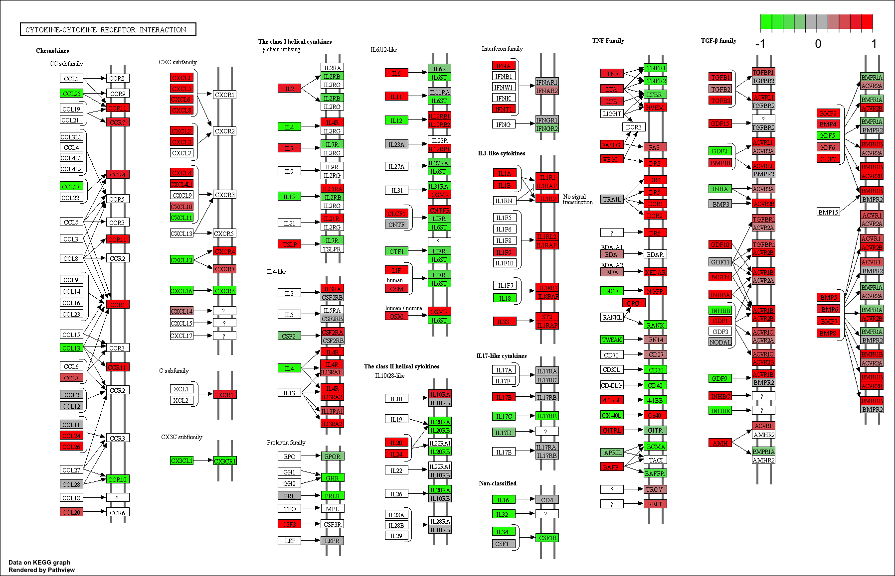
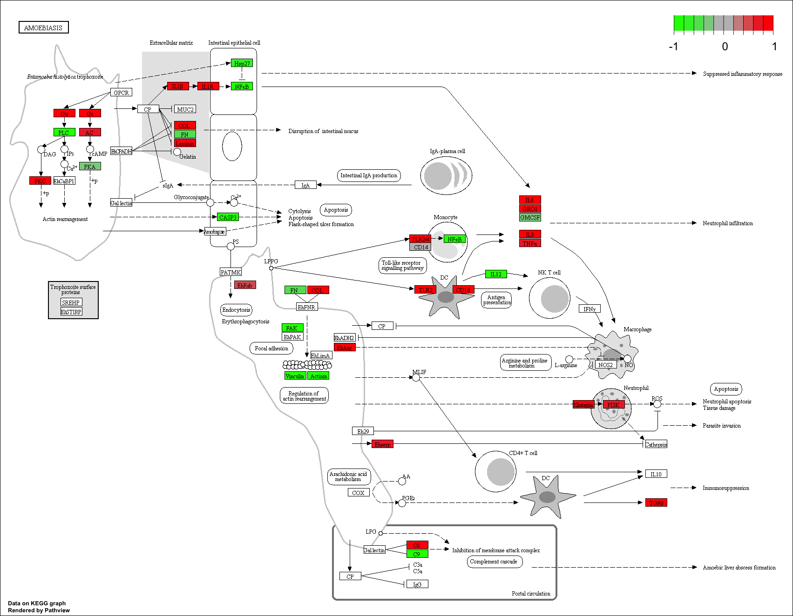
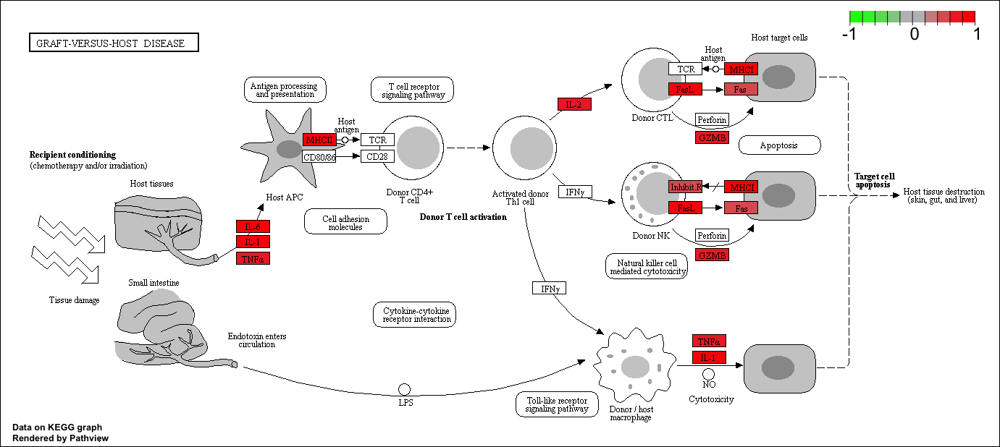

## Genome Annotation and Interpreting Gene Lists
```{r setup, include=FALSE}
knitr::opts_chunk$set(echo = TRUE)
```
High-throughput biological data is usually too massive so pathway analysis can be used to help us gain insight.

Note: Pathway analysis can mean different things to different people.

For this lab, we will be using Trapnell's differential expression geneset that investigates the role of HOXA1 in lung fibroblasts (e.g. in Sailfish).

------

### Section 1. Differential Expression Analysis
#### Data Cleanup
```{r}
# Load DESeq2 package
library(DESeq2)
# Load data files and set 1st row as the row name
colData <- read.csv("https://bioboot.github.io/bimm143_W18/class-material/GSE37704_metadata.csv", row.names = 1)
countData <- read.csv("https://bioboot.github.io/bimm143_W18/class-material/GSE37704_featurecounts.csv", row.names = 1)
# Inspect!
head(colData)
head(countData)
```


Recall that we need these 2 files for DESeq2, with the 1st column of metadata matching the row names of count data. Thus, we need to get rid of the length column in count data
```{r}
# We can access the length column
# countData$length
# countData[,1]
# Negative sign will select everything BUT the column given, i.e. exclude the column
countData <- as.matrix( countData[,-1] )
head(countData)
```

There are genes where the expression is 0 across all samples. Let's filter those out.
```{r}
head( rowSums(countData) )
head( rowSums(countData) == 0)
```

Get rid of the rows that sum up to 0.
```{r}
zero.ind <- rowSums( countData ) == 0
# Negative sign only works on numbers, not logicals! So we need to use exclamation mark to flip. Give it a new name so you are not overriding and changing the file (which could be big!) everytime
countDataFiltered <- countData[ !zero.ind, ]
# Alternatively:
# nonzero.ind <- rowSums( countData ) != 0
# countData <- countDataFiltered[ nonzero.ind, ]
head(countDataFiltered)
```

How many genes are there?
```{r}
nrow(countDataFiltered)
```

#### Running DESeq2
```{r}
# Condition is the variable that counts depend on. See colData
dds = DESeqDataSetFromMatrix(countData = countDataFiltered, colData = colData, design =~ condition)
dds = DESeq(dds)
```

Let's see the results and save them!
```{r}
dds
resultsNames(dds)
res <- results(dds, contrast = c("condition", "hoxa1_kd", "control_sirna"))
```

How many genes are upregulated or downregulated at the default p = 0.1 cutoff?
```{r}
summary(res)
```

27% are upregulated and 28% are downregulated. By calling `summary` with a different argument, we can change the p-value threshold.
```{r}
summary(res, alpha = 0.01)
```

#### Volcano Plot
Let's make a volcano plot with fold change vs. p-value!
```{r}
plot( res$log2FoldChange, -log(res$padj) )
# log of p-value because p-value is tiny; negative because log turns p-value to negative and we want to plot it on positive y-axis
```

How do we add color to the genes that are significantly up/downregulated?
```{r}
# Make a default color vector for all genes
mycols <- rep( "gray", nrow(res) )

# Red for all the genes whose absolute fold change is > 2
mycols[ abs(res$log2FoldChange) > 2 ] <- "red"

# Among the red genes, blue the genes whose p-value is < 0.01
sig.ind <- (res$padj < 0.01) & (abs(res$log2FoldChange) > 2)
mycols[sig.ind] <- "blue"

# You can test the above code with a toy code:
# c(T,T,F) & c(T,F,F)

plot( res$log2FoldChange, -log(res$padj), col = mycols, xlab = "log2(Fold Change)", ylab = "-log(p-value)")
```

Thus, blue dots represent the genes that have an absolute fold change > 2 with a significance of p < 0.01.

#### Adding Gene Annotation
There are a lot of genes in our differential expression geneset (DEG)! We can narrow it down using pathway analysis. However, we need to do some more cleanup because our DEG uses Ensembl gene IDs, but the enrichment geneset we will use (KEGG) uses Entrez gene IDs.
```{r}
# Annotate DEG with SYMBOL, ENTREZID, and GENENAME
# By mapIds() and an annotation file

# Load libraries
library(AnnotationDbi)
library(org.Hs.eg.db)

# Inspect columns available in annotation file
columns(org.Hs.eg.db)

# Add the column "symbol" to our DEG results
res$symbol <- mapIds(org.Hs.eg.db, keys = row.names(res), keytype = "ENSEMBL", column = "SYMBOL", multiVals = "first")
# What does multiVals do?
# When there are multiple matches, only the 1st thing that comes back will be returned. This is the default

# Add the column "entrez" to our DEG results
res$entrez <- mapIds(org.Hs.eg.db, keys = row.names(res), keytype = "ENSEMBL", column = "ENTREZID", multiVals = "first")

# Add the column "name" to our DEG results
res$name <- mapIds(org.Hs.eg.db, keys = row.names(res), keytype = "ENSEMBL", column = "GENENAME", multiVals = "first")

head(res)
```

Looking good! Finally, let's rank these results by adjusted p-value and save them to a new CSV file.
```{r}
res <- res[order(res$padj),]
write.csv(res, file = "deseq_results.csv")
```

### Section 2. Pathway Analysis
In this section, we will use the `gage` package for pathway analysis and the `pathview` package to draw pathway diagrams.

First, we need to do a one-time install of the bioconductor packages `pathview`, `gage`, and `gageData`.
```{r}
# source("http://bioconductor.org/biocLite.R")
# biocLite( c("pathview", "gage", "gageData") )
library(pathview)
library(gage)
library(gageData)

# Load the following data
# This is a list containing 229 elements
# Each element is a vector that contains Entrez IDs for a single KEGG pathway
# See go.sets.hs for more details
# data(go.sets.hs)
# head(go.sets.hs, 2)

data(kegg.sets.hs)

# This is an index of the signaling and metabolic pathways in KEGG (as opposted to globally or human diseases)
data(sigmet.idx.hs)

# Focus on the signaling and metabolic pathways in humans for a cleaner geneset
kegg.sets.hs <- kegg.sets.hs[sigmet.idx.hs]
head(kegg.sets.hs, 2)
# Each of these is an enrichment geneset (blue circle)
# hsa00232 is an identifier in the KEGG pathway database
```

The `gage` function requires a vector of fold changes, with Entrez gene IDs as the name of the vector.
```{r}
# Create a new vector for gage
foldchanges <- res$log2FoldChange
names(foldchanges) <- res$entrez
head(foldchanges)
```

Let's run the `gage` pathway analysis!
```{r}
# The gage function also has a same.dir argument
# If set to true (default), it would test for pathways in a single direction (e.g. up- or downregulated)
keggres <- gage(foldchanges, gsets = kegg.sets.hs)
attributes(keggres)
# These are the pathways that are overall downregulated
head(keggres$less)
head(keggres$greater, 3)

# Let's try same.dir = FALSE
keggres_dir <- gage(foldchanges, gsets = kegg.sets.hs, same.dir = FALSE)
attributes(keggres_dir)
head(keggres_dir$greater, 3)

```

We see that each `keggres$less` object is a data matrix with gene sets as rows, sorted by p-value. Now, we can make a pathway plot with `pathview`.
```{r}
pathview(gene.data = foldchanges, pathway.id = "hsa04110")
# You can play with the pathview function to generate a PDF
# pathview(gene.data = foldchanges, pathway.id = "hsa04110", kegg.native = FALSE)
```


Let's extract the top 5 upregulated pathways for demo.
```{r}
keggres_top5up <- rownames(keggres$greater)[1:5]

# Extract the corresponding pathway IDs
keggres_top5up_id <- substr(keggres_top5up, start = 1, stop = 8)
keggres_top5up_id
```

Now that we have the pathway IDs, we can pass them into `pathview`.
```{r}
pathview(gene.data = foldchanges, pathway.id = keggres_top5up_id, species = "hsa")
```







### Section 3. Gene Ontology (GO)
Similarly, we can use a different enrichment geneset that focuses on biological processes (BP), instead of signaling and metabolic pathways.
```{r}
data(go.sets.hs)
data(go.subs.hs)

# Focus on BP, a subset of GO
go_bpsets <- go.sets.hs[go.subs.hs$BP]
go_bpres <- gage(foldchanges, gsets = go_bpsets, same.dir = TRUE)
lapply(go_bpres, head)
head(go_bpres$greater)
```

### Section 4. Reactome Analysis
We can also do over-representation enrichment analysis and pathway-topology analysis using Reactome.
```{r}
sig_genes <- res[res$padj <= 0.05 & !is.na(res$padj), "symbol"]
print( paste("Total number of significant genes:", length(sig_genes)) )

write.table(sig_genes, file = "significant_genes.txt", row.names = FALSE, col.names = FALSE, quote= FALSE)
```

To perform the pathway analysis, go to the [Reactome web interface](https://reactome.org/PathwayBrowser/#TOOL=AT). Upload significant genes list text file -> Project to Humans -> Analyze.

------

### Reference
Trapnell _et al_. Differential analysis of gene regulation at transcript resolution with RNA-seq. _Nat. Biotechnol._ 2013;31(1):46-53.