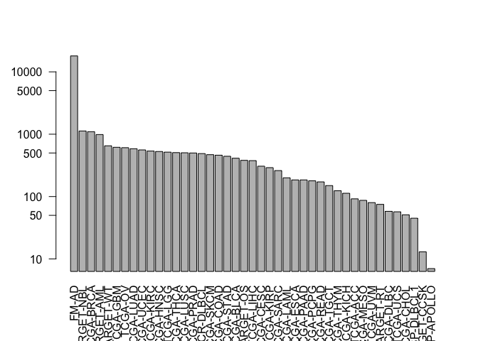
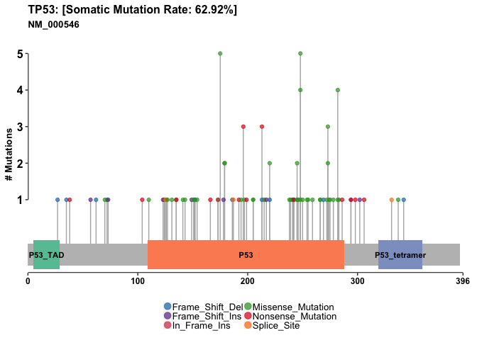

Class 17: Cancer Genomics Part 1
================
Serina Huang
11/29/18

### Section 1. The NCI Genomic Data Commons

The [Genomic Data Commons (GDC)](https://gdc.cancer.gov/about-gdc) website by the National Cancer Institute shares cancer genomic datasets.

Go on the [GDC Web Portal](https://portal.gdc.cancer.gov/) to answer the following questions:

Q1. How many *Cases* (i.e. patient samples) have been found to have p53 mutations?

A1. 4,008.

Q2. What are the top 6 misssense mutations found in this gene? HINT: Scroll down to the *TP53 - Protein* section and mouse over the displayed plot. For example, R175H is found in 156 cases.

A2. R175H, R273C, R248Q, R273H, R248W, R282W.

Q3. Which domain of the protein (as annotated by PFAM) do these mutations reside in?

A3. DNA-binding domain (pink bar).

Q4. What are the top 6 primary sites (i.e. cancer locations such as Lung, Brain, etc.) with p53 mutations and how many primary sites have p53 mutations been found in? HINT: Clicking on the number links in the Cancer Distribution section will take you to a summary of available data accross cases, genes, and mutations for p53. Looking at the *Cases* data will give you a ranked listing of primary sites.

A4. Bronchus and lung; Ovary; Brain; Breast; Colon; Stomach. p53 mutations have been found is 44 primary sites.

Let's practice the same approach on a different protein: KRAS.

Q5. What is the most frequentely mutated position associated with cancer in the KRAS protein (i.e. the amino acid with the most mutations)?

A5. G12 (glycine). In other words, don't touch positions 12 and 13 in amino acid sequences!

Q6. Are KRas mutations common in Pancreatic Adenocarcinoma (i.e. is the Pancreas a common ‘primary site’ for KRas mutations?).

A6. Yes, 137 out of of 182 pancreatic cancer cases have Kras mutations. That's 75.27%!

Q7. What is the ‘TCGA project’ with the most KRas mutations?

A7. TCGA-PAAD.

Q7. What precent of cases for this ‘TCGA project’ have KRas mutations and what precent of cases have p53 mutations? HINT: Placing your mouse over the project bar in the Cancer Distribution panel will bring up a tooltip with useful summary data.

A7. 75.27% of TCGA-PAAD have KRas mutations, compared to 62.64% of TCGA-PAAD that have p53 mutations.

Q8. How many pancreatic adenocarcinoma cases (i.e. patients from the TCGA-PAAD project) have RNA-seq data available?

A8. 177 out of 185 TCGA-PAAD cases total.

Note: We can look at the mutation sites on the protein using VMD. When we do that, we see that the top few mutation sites are all close to the substructure that binds the GNP ligand.

### Section 2. The GenomicDataCommons R Package

The GDC Bioconductor package has functions that query. access, and mine the large genomic datasets on NCI-DGC, e.g. RNA-seq, WXS, SNP, etc. This is important because there are limitations to what we can deduct from the web portal.

We will also use the `maftools` package, which works on files in the Mutation Annotation Format (MAF).

``` r
# One-time install of packages
# source("https://bioconductor.org/biocLite.R")
# biocLite(c("GenomicDataCommons", "maftools"))

# Load packages
library(GenomicDataCommons)
library(maftools)
```

In the next section, we will use `GenomciDataCommons` to identify somatic variants and `maftools` to do a high-level assessment of these variants.

``` r
# Check on GDC status. It should say OK
GenomicDataCommons::status()
```

    ## $commit
    ## [1] "acaf65369f6cea8337c6b59f0888761c9ed34654"
    ## 
    ## $data_release
    ## [1] "Data Release 13.0 - September 27, 2018"
    ## 
    ## $status
    ## [1] "OK"
    ## 
    ## $tag
    ## [1] "1.17.1"
    ## 
    ## $version
    ## [1] 1

### Section 3. Querying the GDC from R

Let's narrow down the data we are interested in. This is called *querying GDC metadata*, where metadata refers to the description associated with the actual patient data (i.e. case) in the GDC.

There are 4 sets of metadata we can query with the `GenomicDataCommons` package: the `cases()`, `projects()`, `files()`, and `annotations()`. Let's start by using `cases()` to find the number of cases in each project.

``` r
# This code snippet from the package will use %>% to pipe (transfer) the output of the LHS function into the input of the RHS function
# Piping is used to avoid nested functions, which can be hard to read or debug

# The cases() function, which takes no argument, is invoked
# The output of cases() is stored into a list called cases_by_project
# The cases_by_project object has 5 fields: fields, filters, facets, legacy, expand
# Next, the output cases_by_project is passed to the function facet() as its first argument
# facet() groups all cases by project ID
# According to the documentation of facet(), the second argument is a character vector in for the following aggregations() function
# Lastly, aggregations() counts up the cases in each project

cases_by_project <- cases() %>%
  facet("project.project_id") %>%
  aggregations()
head(cases_by_project)
```

    ## $project.project_id
    ##               key doc_count
    ## 1           FM-AD     18004
    ## 2      TARGET-NBL      1127
    ## 3       TCGA-BRCA      1098
    ## 4      TARGET-AML       988
    ## 5       TARGET-WT       652
    ## 6        TCGA-GBM       617
    ## 7         TCGA-OV       608
    ## 8       TCGA-LUAD       585
    ## 9       TCGA-UCEC       560
    ## 10      TCGA-KIRC       537
    ## 11      TCGA-HNSC       528
    ## 12       TCGA-LGG       516
    ## 13      TCGA-THCA       507
    ## 14      TCGA-LUSC       504
    ## 15      TCGA-PRAD       500
    ## 16   NCICCR-DLBCL       489
    ## 17      TCGA-SKCM       470
    ## 18      TCGA-COAD       461
    ## 19      TCGA-STAD       443
    ## 20      TCGA-BLCA       412
    ## 21      TARGET-OS       381
    ## 22      TCGA-LIHC       377
    ## 23      TCGA-CESC       307
    ## 24      TCGA-KIRP       291
    ## 25      TCGA-SARC       261
    ## 26      TCGA-LAML       200
    ## 27      TCGA-ESCA       185
    ## 28      TCGA-PAAD       185
    ## 29      TCGA-PCPG       179
    ## 30      TCGA-READ       172
    ## 31      TCGA-TGCT       150
    ## 32      TCGA-THYM       124
    ## 33      TCGA-KICH       113
    ## 34       TCGA-ACC        92
    ## 35      TCGA-MESO        87
    ## 36       TCGA-UVM        80
    ## 37      TARGET-RT        75
    ## 38      TCGA-DLBC        58
    ## 39       TCGA-UCS        57
    ## 40      TCGA-CHOL        51
    ## 41    CTSP-DLBCL1        45
    ## 42    TARGET-CCSK        13
    ## 43 VAREPOP-APOLLO         7

``` r
# Access the data we want
View(cases_by_project$project.project_id)
```

Q9. Recreate the NCI barplot that displays the number of cases per project. The y-axis should be on a log scale and the x-axis should be rotated to allow vertical project labels.

A9.

``` r
x <- cases_by_project$project.project_id
head(x)
```

    ##          key doc_count
    ## 1      FM-AD     18004
    ## 2 TARGET-NBL      1127
    ## 3  TCGA-BRCA      1098
    ## 4 TARGET-AML       988
    ## 5  TARGET-WT       652
    ## 6   TCGA-GBM       617

``` r
# Test plot
barplot(x[,2], names.arg = x[,1], log = "y", las = 2)
```



``` r
# Bonus: What would col = c("lightblue", "red") do?
# Alternate blue and red within the length of the color vector

# Welps, that's ugly
# Make custom color vector and replot
colvec <- rep("lightblue", nrow(x))
paad.ind <- which(x == "TCGA-PAAD")
colvec[paad.ind] <- "red"

# Alternatively, this is probably better:
# (x$key == "TCGA-PAAD")
# Which one of these is TRUE?
# which(x$key == "TCGA-PAAD")

# Replot with sensible margins
par(mar = c(10, 5, 2, 1))
barplot(x[,2], names.arg = x[,1], log = "y", col = colvec, las = 2)
```


Great! Now, let's find all gene expression data files for all pancreatic cancer patients.

``` r
# Another code snippet from the package vignette
file_records <- files() %>%
  filter(~ cases.project.project_id == "TCGA-PAAD" &
    data_type == "Gene Expression Quantification" &
    analysis.workflow_type == "HTSeq - Counts") %>%
response_all()

# This is essentially the same thing we can do on the web portal, but reproducible!
# View(file_records)
```

`file_records$results` contains a row for every RNA-seq data file from the TCGA-PAAD project. As of now, there are `{r}nrow(file_records$results)` projects.

``` r
head(file_records$results)
```

    ##                        data_type                 updated_datetime
    ## 1 Gene Expression Quantification 2018-09-11T22:53:33.639292+00:00
    ## 2 Gene Expression Quantification 2018-09-11T22:53:33.639292+00:00
    ## 3 Gene Expression Quantification 2018-09-11T22:53:33.639292+00:00
    ## 4 Gene Expression Quantification 2018-09-11T22:53:33.639292+00:00
    ## 5 Gene Expression Quantification 2018-09-11T22:53:33.639292+00:00
    ## 6 Gene Expression Quantification 2018-09-11T22:53:33.639292+00:00
    ##                                              file_name
    ## 1 49895f4a-72ac-4d5e-ba56-8c8bb5de4758.htseq.counts.gz
    ## 2 8a799dfa-c1b5-4b13-9c91-6cbfe2abbc9f.htseq.counts.gz
    ## 3 b78b6f49-3cb2-452a-a41c-6dfa90e631db.htseq.counts.gz
    ## 4 aec2e0c7-4792-41af-873c-3f3a53ec6d38.htseq.counts.gz
    ## 5 657e19a6-e481-4d06-8613-1a93677f3425.htseq.counts.gz
    ## 6 4172e3f8-3578-4f33-9168-6f8c2b8d0783.htseq.counts.gz
    ##                                 submitter_id
    ## 1 49895f4a-72ac-4d5e-ba56-8c8bb5de4758_count
    ## 2 8a799dfa-c1b5-4b13-9c91-6cbfe2abbc9f_count
    ## 3 b78b6f49-3cb2-452a-a41c-6dfa90e631db_count
    ## 4 aec2e0c7-4792-41af-873c-3f3a53ec6d38_count
    ## 5 657e19a6-e481-4d06-8613-1a93677f3425_count
    ## 6 4172e3f8-3578-4f33-9168-6f8c2b8d0783_count
    ##                                file_id file_size
    ## 1 d257277b-072f-4b6c-bead-07332de2a533    253547
    ## 2 167aef29-9e90-4bd1-ab3c-49bdb9866939    260246
    ## 3 0c931ae0-0169-4084-be7f-e50a330baa99    253906
    ## 4 fdf73b53-a45b-4f06-8418-19896fc3d076    255095
    ## 5 52d2e6bb-80f3-42a7-b2d4-cc72e5fd83f1    254576
    ## 6 7e374f79-6f9b-4034-b4cb-d71b7404682a    255804
    ##                                     id                 created_datetime
    ## 1 d257277b-072f-4b6c-bead-07332de2a533 2016-05-29T10:41:56.268330-05:00
    ## 2 167aef29-9e90-4bd1-ab3c-49bdb9866939 2016-05-26T21:10:39.562381-05:00
    ## 3 0c931ae0-0169-4084-be7f-e50a330baa99 2016-05-26T21:26:50.741787-05:00
    ## 4 fdf73b53-a45b-4f06-8418-19896fc3d076 2016-05-29T10:30:41.561524-05:00
    ## 5 52d2e6bb-80f3-42a7-b2d4-cc72e5fd83f1 2016-05-29T11:08:43.811369-05:00
    ## 6 7e374f79-6f9b-4034-b4cb-d71b7404682a 2016-05-30T18:32:45.805450-05:00
    ##                             md5sum data_format  acl access    state
    ## 1 661f22b698d45a10f6c00e420c6a2fbd         TXT open   open released
    ## 2 fd8ed974721299c7fce17d0722d6e8e2         TXT open   open released
    ## 3 c10791f045d9d3e02747a12c1716baae         TXT open   open released
    ## 4 8332437c278e6a16f8af95d13bb24ab4         TXT open   open released
    ## 5 b165dcb355976a361d16fd3a98e39783         TXT open   open released
    ## 6 ea2325dbb6d75ebd2fd8013d986ada4c         TXT open   open released
    ##             data_category            type experimental_strategy
    ## 1 Transcriptome Profiling gene_expression               RNA-Seq
    ## 2 Transcriptome Profiling gene_expression               RNA-Seq
    ## 3 Transcriptome Profiling gene_expression               RNA-Seq
    ## 4 Transcriptome Profiling gene_expression               RNA-Seq
    ## 5 Transcriptome Profiling gene_expression               RNA-Seq
    ## 6 Transcriptome Profiling gene_expression               RNA-Seq

We can download these R tools. For larger datasets like this one, the `transfer()` function can perform more robust data downloads by using the GDC transfer client (a separate command-line tool).

### Section 4. Variant Analysis

We can do a file query using Advanced Search on the NCI-GDC web portal to find all the MAF somation mutation files in the TCGA-PADD project. The search term is `cases.project.project_id in ["TCGA-PAAD"] and files.data_type in ["Masked Somatic Mutation"] and files.data_format in ["MAF"]`.

Q10. How many MAF files for the TCGA-PAAD project were found from this advanced web search?

A10. 4 files.

Alternatively, we can perform the same search in R with the `files()` function from the `GenomicDataCommons` package. Note: The last term focuses on only one of the MAF files for this project in GDC, namely the MuTect2 workflow variant calls.

``` r
maf.files = files() %>%
    filter(~ cases.project.project_id == 'TCGA-PAAD' &
        data_type == 'Masked Somatic Mutation' &
        data_format == "MAF" &
        analysis.workflow_type == "MuTect2 Variant Aggregation and Masking") %>%
response_all()
```

``` r
# View(maf.files)
attributes(maf.files)
```

    ## $names
    ## [1] "results"      "query"        "pages"        "aggregations"
    ## 
    ## $class
    ## [1] "GDCfilesResponse" "GDCResponse"      "list"

``` r
head(maf.files$results)
```

    ##                 data_type                 updated_datetime
    ## 1 Masked Somatic Mutation 2018-09-11T22:53:33.639292+00:00
    ##                                                                      file_name
    ## 1 TCGA.PAAD.mutect.fea333b5-78e0-43c8-bf76-4c78dd3fac92.DR-10.0.somatic.maf.gz
    ##                           submitter_id
    ## 1 TCGA-PAAD-mutect-public_10.0_new_maf
    ##                                file_id file_size
    ## 1 fea333b5-78e0-43c8-bf76-4c78dd3fac92   6991687
    ##                                     id                 created_datetime
    ## 1 fea333b5-78e0-43c8-bf76-4c78dd3fac92 2017-12-01T17:52:47.832941-06:00
    ##                             md5sum data_format  acl access    state
    ## 1 cdddbf7bc36774e85a5033ad1be223ba         MAF open   open released
    ##                 data_category                    type
    ## 1 Simple Nucleotide Variation masked_somatic_mutation
    ##   experimental_strategy
    ## 1                   WXS

Q11. What line in the above code could be modified to return all MAF files for the TCGA-PAAD project?

A11.

``` r
allpaadmaf.files = files() %>%
    filter(~ cases.project.project_id == 'TCGA-PAAD' &
        data_format == "MAF") %>%
response_all()

# View(allpaadmaf.files)
```

Use the `ids()` function to pull out the unique identifier for our MAF file.

``` r
uid <- ids(maf.files)
uid
```

    ## [1] "fea333b5-78e0-43c8-bf76-4c78dd3fac92"

``` r
# Download file to cache
maffile = gdcdata(uid)
maffile
```

    ##                                                                                                                                fea333b5-78e0-43c8-bf76-4c78dd3fac92 
    ## "/Users/Serina/Library/Caches/GenomicDataCommons/fea333b5-78e0-43c8-bf76-4c78dd3fac92/TCGA.PAAD.mutect.fea333b5-78e0-43c8-bf76-4c78dd3fac92.DR-10.0.somatic.maf.gz"

This is the file we want to download. Do so with the `gdcdata()` function.

``` r
# Download maf file
maffile = gdcdata(uid)
maffile
```

    ##                                                                                                                                fea333b5-78e0-43c8-bf76-4c78dd3fac92 
    ## "/Users/Serina/Library/Caches/GenomicDataCommons/fea333b5-78e0-43c8-bf76-4c78dd3fac92/TCGA.PAAD.mutect.fea333b5-78e0-43c8-bf76-4c78dd3fac92.DR-10.0.somatic.maf.gz"

Now the maf file has been downloaded into our cache directory, we are ready for analysis using the `maftools` package.

#### MAF Analysis

``` r
vars = read.maf(maf = maffile, verbose = FALSE)
```

    ## Taking input= as a system command ('zcat < /Users/Serina/Library/Caches/GenomicDataCommons/fea333b5-78e0-43c8-bf76-4c78dd3fac92/TCGA.PAAD.mutect.fea333b5-78e0-43c8-bf76-4c78dd3fac92.DR-10.0.somatic.maf.gz') and a variable has been used in the expression passed to `input=`. Please use fread(cmd=...). There is a security concern if you are creating an app, and the app could have a malicious user, and the app is not running in a secure envionment; e.g. the app is running as root. Please read item 5 in the NEWS file for v1.11.6 for more information and for the option to suppress this message.

Here are a few things `maftools` can do.

#### Plotting MAF Summary

The `plotmacSummary()` function makes a summary plot. For example, the **Variant Classification** boxplot displays the variant types. The **Variants per sample** stacked barplot displays the number of variants in each sample. We can modify the arguments of this function to display the average/median.

``` r
plotmafSummary(maf =vars, rmOutlier = TRUE,
               addStat = 'median', dashboard = TRUE,
               titvRaw = FALSE)
```


#### Drawing Oncoplots

A useful summary representation of this data can be obtained from `oncoplot`, which is also called a waterfall plot.

``` r
oncoplot(maf = vars, top = 10)
```


``` r
# Since the oncoplot is a large image, send this plot to a PNG or PDF.
# Send the oncoplot for our top 10 most frequently mutated genes to a PDF
pdf("oncogene_panc.pdf")
oncoplot(maf = vars, top = 10, fontSize = 12)
dev.off()
```

    ## quartz_off_screen 
    ##                 2

#### Oncostrip

`oncostrip` lets us visualize any set of genes by drawing the mutations of specific genes in each sample.

``` r
oncostrip(maf = vars, genes = c("KRAS", "TP53"))
```


#### Lollipop Plot

``` r
lollipopPlot(maf = vars, gene = "KRAS", showMutationRate = TRUE, domainLabelSize = 3)
```

    ## Assuming protein change information are stored under column HGVSp_Short. Use argument AACol to override if necessary.

    ## 2 transcripts available. Use arguments refSeqID or proteinID to manually specify tx name.

    ##    HGNC refseq.ID protein.ID aa.length
    ## 1: KRAS NM_004985  NP_004976       188
    ## 2: KRAS NM_033360  NP_203524       189

    ## Using longer transcript NM_033360 for now.


``` r
lollipopPlot(maf = vars, gene = "TP53", showMutationRate = TRUE, domainLabelSize = 3)
```

    ## Assuming protein change information are stored under column HGVSp_Short. Use argument AACol to override if necessary.

    ## 8 transcripts available. Use arguments refSeqID or proteinID to manually specify tx name.

    ##    HGNC    refseq.ID   protein.ID aa.length
    ## 1: TP53    NM_000546    NP_000537       393
    ## 2: TP53 NM_001126112 NP_001119584       393
    ## 3: TP53 NM_001126118 NP_001119590       354
    ## 4: TP53 NM_001126115 NP_001119587       261
    ## 5: TP53 NM_001126113 NP_001119585       346
    ## 6: TP53 NM_001126117 NP_001119589       214
    ## 7: TP53 NM_001126114 NP_001119586       341
    ## 8: TP53 NM_001126116 NP_001119588       209

    ## Using longer transcript NM_000546 for now.



------------------------------------------------------------------------

### Summary

In part 1, we explored the Genomic Data Commons hosted by the National Cancer Institute in both its web portal and Bioconductor package forms. For the latter, there are multiple functions that can be used in conjunction with the `maftools` package to make informative plots.
