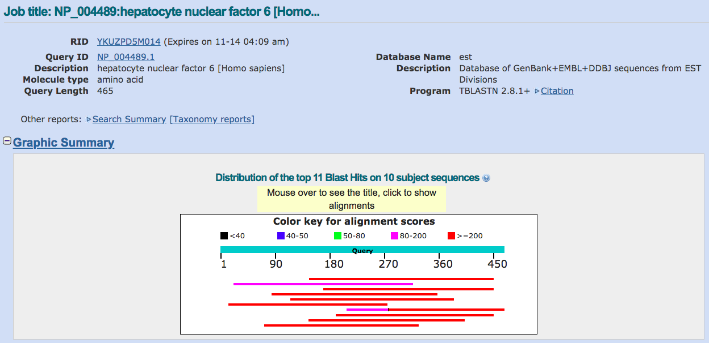
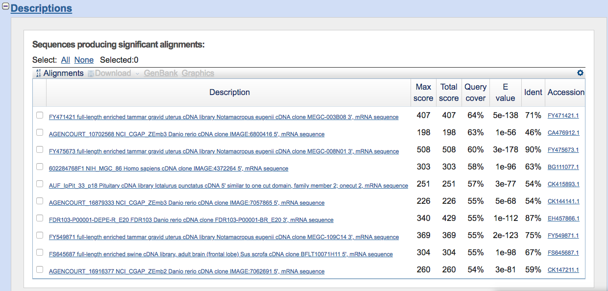
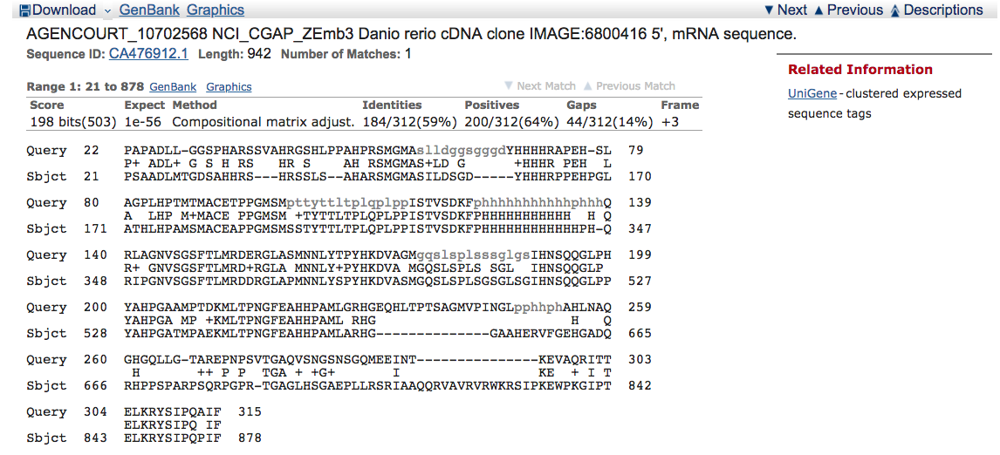
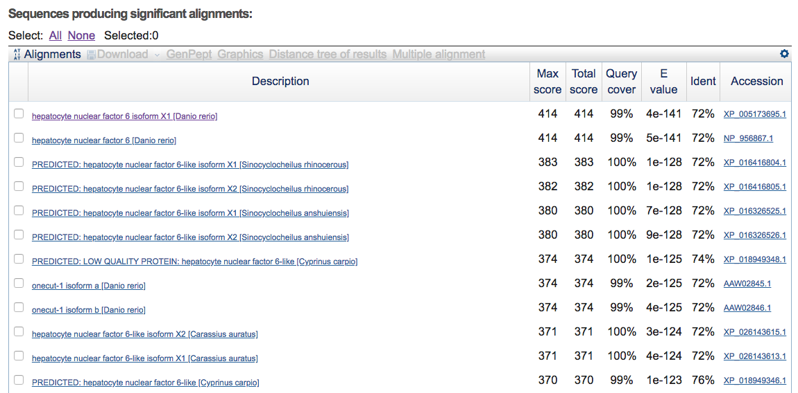
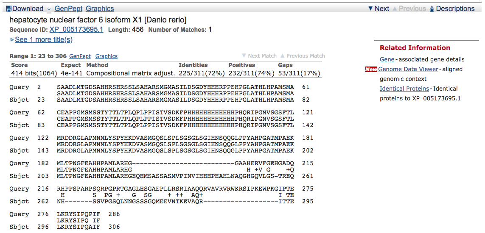
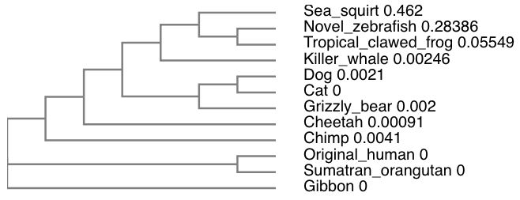

```{r setup, include=FALSE}
knitr::opts_chunk$set(echo = TRUE)
```

# Q1.

Protein: Hepatocyte Nuclear Factor 6 (HNF6)

Species: Homo sapiens

Accession number: NP_004489

Function known: A transcription factor in the Cut homeobox family. Expression of HNF6 is enriched in the liver, which it stimulates transcription of liver-specific genes and antagonizes glucocorticoid-stimulated gene expression. May influence glucose metabolism, cell cycle regulation, and may be associated with cancer.

# Q2.

Method: TBLASTN (2.8.1)

Database: Expressed sequence tags (est)

Limit organism: All species

Alignment of choice: BLOSUM62

Chosen match: Assession CA476912.1, a 942 bp clone from _Danio rerio_.

```{r, out.width = "100%", echo = FALSE}



```

# Q3.

Chosen sequence:
\color{brown}
```{r, comment = "", echo = FALSE}
cat(readLines("rerio.fasta"), sep = "\n")
```

\color{black}
Name: Danio transcription factor

Species: _Danio rerio_

Eukaryota; Metazoa; Chordata; Craniata; Vertebrata; Euteleostomi; Actinopterygii; Neopterygii; Teleostei; Ostariophysi; Cypriniformes; Cyprinidae; Danio.

# Q4.

Method: BLASTP 2.8.1

Database: Non-redundant protein sequences (nr)
```{r, out.width = "100%", echo = FALSE}



```

# Q5. 
Relabeled sequences:
\color{NavyBlue}
```{r, comment = "", echo = FALSE}
cat(readLines("msa.fasta"), sep = "\n")
```


\color{Black}
Alignment using EBI's MUSCLE:
\color{Brown}
```{r, comment = "", echo = FALSE}
cat(readLines("muscle.clw"), sep = "\n")
```

\color{Black}
Note: The gap overhang in this alignment file was necessary becasue the sea_squirt's sequence has multiple insertions compared to other species' sequences.

# Q6.
Phylogenetic tree using EBI's "Simple Phylogeny" feature.
```{r, out.width = "100%", echo = FALSE}

```

# Q7.
Read MUSCLE alignment file into Seaview and saved file as FASTA.
```{r, echo = FALSE, fig.align = "center"}
library(bio3d)
muscle_alignment <- read.fasta("muscle.fst")
identity <- seqidentity(muscle_alignment)
heatmap(identity, margins = c(9,9), cexRow = 0.7, cexCol = 0.7)
```

# Q8.
Because my consensus sequence contains a lot of gaps, I will choose the sequence with the highest identity in the alignment. To do so, I will first calculate the sum of each row in the identity matrix. Then, I will find the first sequence with the maximum sum.
```{r}
sums <- rowSums(identity)
which.max(sums)
```

Thus, in the main protein structure database, I will use the Original_human sequence to search for the most similar atomic resolution structure to my aligned sequences.
```{r}
human <- read.fasta("human.fasta")
hits <- blast.pdb(human, database = "pdb")
# head(hits, 3)
```

We see that the top 3 unique hits are **2D5V_A**, **1S7E_A**, and **1WH6_A**. I will save these to a new dataframe and add my own annotations: structure ID, method used to solve the structure, resolution, and source organism.
```{r}
top <- hits$hit.tbl[1:3,]
anno <- pdb.annotate(top$pdb.id)
top_anno <- merge(top, anno, by.x = "pdb.id", by.y = "row.names")

# Only take relevant columns
relevant_colnames <- c("pdb.id", "experimentalTechnique", "resolution", "source", "evalue", "identity")
x <- match( relevant_colnames, colnames(top_anno) )
top_anno_relevant <- top_anno[,x]

# Last thing, split PDB identifier on the underscore
ids <- top_anno_relevant$pdb.id
# Split PDB identifier on the underscore
ids_split <- strsplit(ids, "_")
# [[ is synonymous to $. They both select an element from a list
top_anno_relevant$pdb.id <- lapply(ids_split, "[[", 1)
top_anno_relevant
```

# Q9.
Here, I will generate a molecular figure of the first identified PDB structure, 1S7E, using VMD. After downloading the pdb file from Protein Data Bank, load the molecule into VMD.
```{r, out.width = "60%", echo = FALSE, fig.align = "center"}
knitr::include_graphics('1s7e.png')
```

The sequence similarity is 100% for 1S7E. Thus, this structure from _Mus musculus_ is very likely to be similar to my "novel" _Danio rerio_ protein.

# Q10.
Searched [ChEMBEL](https://www.ebi.ac.uk/chembl/) with my novel sequence. Found 1 Binding Assay and 0 Functional Assay for CHEMBL2176818 (*Mus musculus*, which was the closest because no *Danio rerio* data was available) but 0 Ligand Efficiency Data.

Binding Assay: https://www.ebi.ac.uk/chembl/assay/inspect/CHEMBL2186578

Pioglitazone and rosiglitazone are two diabetes drugs that share a common functional core: glitazone. Two variants of the glitazone scaffold, pioglitazone and rosiglitazone, are tested to identify off-target binding events in the rat heart. The purpose of these tests is to explain recently reported cardiovascular risk associated with these drugs.

Results suggest that glitazone has affinity for dehydrogenases. Both drugs bind ion channels and modulators, with implications in congestive heart failure, arrhythmia, and peripheral edema. Additional proteins involved in glucose homeostasis, synaptic transduction, and mitochondrial energy production were detected and potentially contribute to drug efficacy and cardiotoxicity.

Hoffmann BR, El-Mansy MF, Sem DS, Greene AS. Chemical proteomics-based analysis of off-target binding profiles for rosiglitazone and pioglitazone: clues for assessing potential for cardiotoxicity. *J. Med. Chem.* (2012)55:8260-8271. doi: [10.1021/jm301204r](http://dx.doi.org/10.1021/jm301204r).