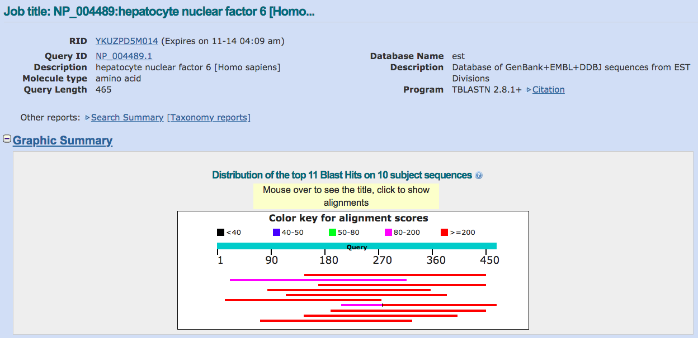
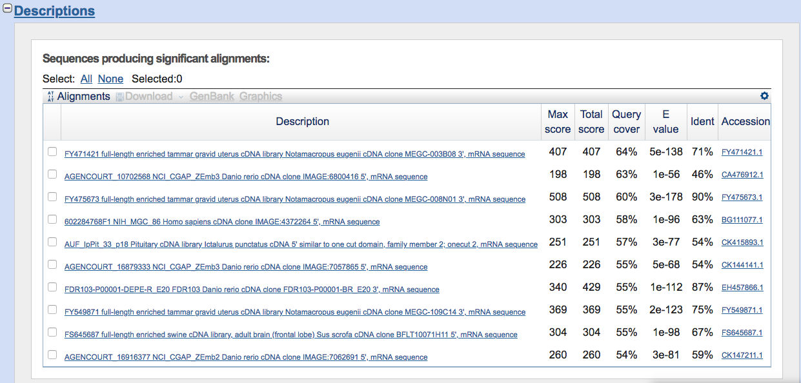
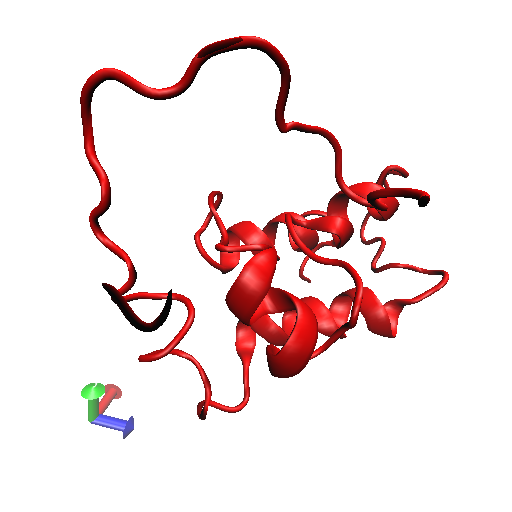

Find a Gene
================
Serina Huang, <seh004@ucsd.edu>, A12245564
December 3, 2018


Q1.
===

Protein: Hepatocyte Nuclear Factor 6 (HNF6)

Species: Homo sapiens

Accession number: NP\_004489

Function known: A transcription factor in the Cut homeobox family. Expression of HNF6 is enriched in the liver, which it stimulates transcription of liver-specific genes and antagonizes glucocorticoid-stimulated gene expression. May influence glucose metabolism, cell cycle regulation, and may be associated with cancer.

Q2.
===

Method: TBLASTN (2.8.1)

Database: Expressed sequence tags (est)

Limit organism: All species

Alignment of choice: BLOSUM62

Chosen match: Assession CA476912.1, a 942 bp clone from *Danio rerio*.



Q3.
===

Chosen sequence:

    >D. rerio protein (sequence taken from BLAST result)
    PSAADLMTGDSAHHRSHRSSLSAHARSMGMASILDSGDYHHHRPPEHPGLATHLHPAMSMACEAPPGMSM
    SSTYTTLTPLQPLPPISTVSDKFPHHHHHHHHHHHHPHQRIPGNVSGSFTLMRDDRGLAPMNNLYSPYHK
    DVASMGQSLSPLSGSGLSGIHNSQQGLPPYAHPGATMPAEKMLTPNGFEAHHPAMLARHGGAAHERVFGE
    HGADQRHPPSPARPSQRPGPRTGAGLHSGAEPLLRSRIAAQQRVAVRVRWKRSIPKEWPKGIPTELKRYS
    IPQPIF

 Name: Danio transcription factor

Species: *Danio rerio*

Eukaryota; Metazoa; Chordata; Craniata; Vertebrata; Euteleostomi; Actinopterygii; Neopterygii; Teleostei; Ostariophysi; Cypriniformes; Cyprinidae; Danio.

Q4.
===

Method: BLASTP 2.8.1

Database: Non-redundant protein sequences (nr) 

Q5.
===

Relabeled sequences:

    >Novel_zebrafish
    PSAADLMTGDSAHHRSHRSSLSAHARSMGMASILDSGDYHHHRPPEHPGLATHLHPAMSMACEAPPGMSM
    SSTYTTLTPLQPLPPISTVSDKFPHHHHHHHHHHHHPHQRIPGNVSGSFTLMRDDRGLAPMNNLYSPYHK
    DVASMGQSLSPLSGSGLSGIHNSQQGLPPYAHPGATMPAEKMLTPNGFEAHHPAMLARHGGAAHERVFGE
    HGADQRHPPSPARPSQRPGPRTGAGLHSGAEPLLRSRIAAQQRVAVRVRWKRSIPKEWPKGIPTELKRYS
    IPQPIF

    >Original_human
    MNAQLTMEAIGELHGVSHEPVPAPADLLGGSPHARSSVAHRGSHLPPAHPRSMGMASLLDGGSGGGDYHH
    HHRAPEHSLAGPLHPTMTMACETPPGMSMPTTYTTLTPLQPLPPISTVSDKFPHHHHHHHHHHHPHHHQR
    LAGNVSGSFTLMRDERGLASMNNLYTPYHKDVAGMGQSLSPLSSSGLGSIHNSQQGLPHYAHPGAAMPTD
    KMLTPNGFEAHHPAMLGRHGEQHLTPTSAGMVPINGLPPHHPHAHLNAQGHGQLLGTAREPNPSVTGAQV
    SNGSNSGQMEEINTKEVAQRITTELKRYSIPQAIFAQRVLCRSQGTLSDLLRNPKPWSKLKSGRETFRRM
    WKWLQEPEFQRMSALRLAACKRKEQEHGKDRGNTPKKPRLVFTDVQRRTLHAIFKENKRPSKELQITISQ
    QLGLELSTVSNFFMNARRRSLDKWQDEGSSNSGNSSSSSSTCTKA

    >Sumatran_orangutan
    MNAQLTMEAIGELHGVSHEPVPAPADLLGGSPHARSSVAHRGSHLPPAHPRSMGMASLLDGGSGGGDYHH
    HHRAPEHSLAGPLHPTMTMACETPPGMSMPTTYTTLTPLQPLPPISTVSDKFPHHHHHHHHHHHPHHHQR
    LAGNVSGSFTLMRDERGLASMNNLYTPYHKDVAGMGQSLSPLSSSGLGSIHNSQQGLPHYAHPGAAMPTD
    KMLTPNGFEAHHPAMLGRHGEQHLTPTSAGMVPINGLPPHHPHAHLNAQGHGQLLGTAREPNPSVTGAQV
    SNGSNSGQMEEINTKEVAQRITTELKRYSIPQAIFAQRVLCRSQGTLSDLLRNPKPWSKLKSGRETFRRM
    WKWLQEPEFQRMSALRLAACKRKEQEHGKDRGNTPKKPRLVFTDVQRRTLHAIFKENKRPSKELQITISQ
    QLGLELSTVSNFFMNARRRSLDKWQDEGSSNSGNSSSSSSTCTKA

    >Gibbon
    MNAQLTMEAIGELHGVSHEPVPAPADLLGGSPHARSSVAHRGSHLPPAHPRSMGMASLLDGGSGGGDYHH
    HHRAPEHSLAGPLHPTMTMACETPPGMSMPTTYTTLTPLQPLPPISTVSDKFPHHHHHHHHHHHPHHHQR
    LAGNVSGSFTLMRDERGLASMNNLYTPYHKDVAGMGQSLSPLSSSGLGSIHNSQQGLPHYAHPGAAMPTD
    KMLTPNGFEAHHPAMLGRHGEQHLTPTSAGMVPINGLPPHHPHAHLNAQGHGQLLGTAREPNPSVTGAQV
    SNGSNSGQMEEINTKEVAQRITTELKRYSIPQAIFAQRVLCRSQGTLSDLLRNPKPWSKLKSGRETFRRM
    WKWLQEPEFQRMSALRLAACKRKEQEHGKDRGNTPKKPRLVFTDVQRRTLHAIFKENKRPSKELQITISQ
    QLGLELSTVSNFFMNARRRSLDKWQDEGSSNSGNSSSSSSTCTKA

    >Cheetah
    MNAQLTMEAIGELHGVSHEPVPAPADLLGGSPHARSSVAHRGSHLPPAHPRSMGMASLLDGGGGGGDYHH
    HHRAPEHSLAGPLHPTMTMACETPPGMSMPTTYTTLTPLQPLPPISTVSDKFPHHHHHHHHHHHPHHHQR
    LAGNVSGSFTLMRDERGLASMNNLYTPYHKDVAGMGQSLSPLSSSGLGSIHNSQQGLPHYAHPGAAMPTD
    KMLTPNGFEAHHPAMLGRHGEQHLTPTSAGMVPINGLPPHHPHAHLNAQGHGQLLGTAREPNPSVTGAQV
    SNGSNSGQMEEINTKEVAQRITTELKRYSIPQAIFAQRVLCRSQGTLSDLLRNPKPWSKLKSGRETFRRM
    WKWLQEPEFQRMSALRLAACKRKEQEHGKDRGNTPKKPRLVFTDVQRRTLHAIFKENKRPSKELQITISQ
    QLGLELSTVSNFFMNARRRSLDKWQDEGSSNSGNSSSSSSTCTKA

    >Chimp
    MNAQLTMEAIGELHGVSHEPVPAPADLLGGSPHARSSVAHRGSHLPPAHPRSMGMASLLDGGSGGGDYHH
    HHRAPEHSLAGPLHPTMTMACETPPGMSMPTTYTTLTPLQPLPPISTVSDKFPHHHHHHHHHHHPHHHQR
    LAGNVSGSFTLMRDERGLASMNNLYTPYHKDVAGMGQSLSPLSSSGLGSIHNSQQGLPHYAHPGTTMPTD
    KMLTPNGFEAHHPAMLGRHGEQHLTPTSAGMVPINGLPPHHPHAHLNAQGHGQLLGTAREPNPSVTGAQV
    SNGSNSGQMEEINTKEVAQRITTELKRYSIPQAIFAQRVLCRSQGTLSDLLRNPKPWSKLKSGRETFRRM
    WKWLQEPEFQRMSALRLAACKRKEQEHGKDRGNTPKKPRLVFTDVQRRTLHAIFKENKRPSKELQITISQ
    QLGLELSTVSNFFMNARRRSLDKWQDEGSSNSGNSSSSSSTCTKA

    >Cat
    MNAQLTMEAIGELHGVSHEPVPAPADLLGGSPHARSSVAHRGSHLPPAHPRSMGMASLLDGGGGGGDYHH
    HHRAPEHSLAGPLHPTMTMACETPPGMSMPTTYTTLTPLQPLPPISTVSDKFPHHHHHHHHHHHPHHHQR
    LAGNVSGSFTLMRDERGLASMNNLYTPYHKDVAGMGQSLSPLSSSGLGGIHNSQQGLPHYAHPGAAMPTD
    KMLTPNGFEAHHPAMLGRHGEQHLTPTSAGMVPINGLPPHHPHAHLNAQGHGQLLGTAREPNPSVTGAQV
    SNGSNSGQMEEINTKEVAQRITTELKRYSIPQAIFAQRVLCRSQGTLSDLLRNPKPWSKLKSGRETFRRM
    WKWLQEPEFQRMSALRLAACKRKEQEHGKDRGNTPKKPRLVFTDVQRRTLHAIFKENKRPSKELQITISQ
    QLGLELSTVSNFFMNARRRSLDKWQDEGSSNSGNSSSSSSTCTKA

    >Grizzly_bear
    MNAQLTMEAIGELHGVSHEPVPAPADLLGGSPHARSSVAHRGSHLPPAHPRSMGMASLLDGGGGGGDYHH
    HHRAPEHSLAGPLHPTMTMACETPPGMSMPTTYTTLTPLQPLPPISTVSDKFPHHHHHHHHHHHPHHHQR
    LAGNVSGSFTLMRDERGLASMNNLYTPYHKDVAGMGQSLSPLSTSGLGGIHNSQQGLPHYAHPGAAMPTD
    KMLTPNGFEAHHPAMLGRHGEQHLTPTSAGMVPINGLPPHHPHAHLNAQGHGQLLGTAREPNPSVTGAQV
    SNGSNSGQMEEINTKEVAQRITTELKRYSIPQAIFAQRVLCRSQGTLSDLLRNPKPWSKLKSGRETFRRM
    WKWLQEPEFQRMSALRLAACKRKEQEHGKDRGNTPKKPRLVFTDVQRRTLHAIFKENKRPSKELQITISQ
    QLGLELSTVSNFFMNARRRSLDKWQDEGSSNSGNSSSSSSTCTKA

    >Dog
    MNAQLTMEAIGELHGVSHEPVPAPADLLGGSPHARSSVAHRGSHLPPAHPRSMGMASLLDGGGGGGDYHH
    HHRAPEHSLAGPLHPTMTMACETPPGMSMPTTYTTLTPLQPLPPISTVSDKFPHHHHHHHHHHHPHHHQR
    LAGNVSGSFTLMRDERGLASMNNLYTPYHKDVAGMGQSLSPLSSSGLSGIHNSQQGLPHYAHPGAAMPTD
    KMLTPNGFEAHHPAMLGRHGEQHLTPTSAGMVPINGLPPHHPHAHLNAQGHGQLLGTAREPNPSVTGAQV
    SNGSNSGQMEEINTKEVAQRITTELKRYSIPQAIFAQRVLCRSQGTLSDLLRNPKPWSKLKSGRETFRRM
    WKWLQEPEFQRMSALRLAACKRKEQEHGKDRGNTPKKPRLVFTDVQRRTLHAIFKENKRPSKELQITISQ
    QLGLELSTVSNFFMNARRRSLDKWQDEGSSNSGNSSSSSSTCTKA

    >Killer_whale
    MNAQLTMEAIGELHGVSHEPVPAPADLLGGSPHARSSVAHRGSHLPPAHPRSMGMASLLDGGSGSGDYHH
    HHRAPEHSLAGPLHPTMTMACETPPGMSMPTTYTTLTPLQPLPPISTVSDKFPHHHHHHHHHHHPHHHQR
    LAGNVSGSFTLMRDERGLASMNNLYTPYHKDVAGMGQSLSPLSGSGLGGIHNSQQGLPHYAHPGAAMPTD
    KMLTPNGFEAHHPAMLGRHGEQHLTPTSAGMVPINGLPPHHPHAHLNAQGHGQLLGTAREPNPSVTGAQV
    SNGSNSGQMEEINTKEVAQRITTELKRYSIPQAIFAQRVLCRSQGTLSDLLRNPKPWSKLKSGRETFRRM
    WKWLQEPEFQRMSALRLAACKRKEQEHGKDRGNTPKKPRLVFTDVQRRTLHAIFKENKRPSKELQITISQ
    QLGLELSTVSNFFMNARRRSLDKWQDEGSSNSGNSSSSSSTCTKA

    >Tropical_clawed_frog
    MNAQLTMDAIGDLHGISHESVPGTADLMGSSPHHRGSVTHRSNHLSAHPRSMGMASILDGGDYHHHHHHH
    HRPPDHALTGPLHPTMTMACDTPPGMSMSSTYTTLTPLQPLPPISTVSDKFPHHHHHHHPHQRIPGNVSG
    SFTLMRDDRGLASMNNLYSPYHKEVTGMGQSLSPLSGSGLGSIHGAQQGPPHYAHPSAAMPTEKMLTPNG
    FEAHHPAMLTRHGEQHLTPPSAGMVPINGIPHHPHAHLNAQSHGQILASTRDQNPPSVTGSQINNGSNSG
    QMEEINTKEVAQRITTELKRYSIPQAIFAQRVLCRSQGTLSDLLRNPKPWSKLKSGRETFRRMWKWLQEP
    EFQRMSALRLAALVPADPVFQHSGQLPADSLVKIGYPSQSTQSNHMSCKRKEQEHGKDRGNTPKKPRLVF
    TDVQRRTLHAIFKENKRPSKELQITISQQLGLELSTVSNFFMNARRRSLDKWQDEGNSGSGNTSSSSSTC
    TKA

    >Sea_squirt
    MPVSLGQSVTTSPSAKSASILNQQHPGIATDFITMATAASGELNGFHHLHHHHHPSEQYYRHEHYHHHFH
    HPNFDGYPNYNDRDTPIAGDMQKNNLHNFASKSMSLEGEKLDENCNKSPNYLPPIGDALLRRDNRSDASK
    NNAKEEDESGCSKFVMQETDNSLTELQKSSAVSEHEKKEEVQLKTNDAPEDFSVKTEQSELYQFHARNFS
    IFTPSSQRGTPDEGMNLIPVETTDHTSIDSYFRSDATNANPNSNPIDSVPSSVDGPSYATLTPLQPLPSI
    SSVSDKYMPTNETSYATLTNQELTDCSSYSKMGGMGHSLPPLSNRMILNGLAAQTRGGMQSQAAIDAVNQ
    AAAAAVGLSHYNKPVLSSNIIPPPPPVSNPYDPHVFGRIDQCNDMGAGFPGGHMFPHRSTGFVSQYGLQD
    LSSSLQVSAPSERRRPTHEDIPADNGKRHSGSDRLGGSGLQPHSSNSASSSRTQQIEEVNTKEVASKITQ
    ELKRYSIPQAIFAQRVLCRSQGTLSDLLRNPKPWSKLKSGRETFRRMWKWLQEPEFQRMSSLRLAACKRK
    EDEKSYENSVNSPKKPRLVFTDLQRRTLHAIFKESKRPSKEMQIQISQQLGLEVTTVSNFFMNARRRSLD
    KWQDDESGYNSKENSRSNNPSSDHHLSASPNHQQQQQQQQQQQQQQQQQAYQQHTQDSRLSYAPGESLLS
    PLCGSPSGHLHFPPPHHLHHHNLHQQQQNTMLSASHLTSSGLVHPYQSQHQLLGSDVTGLVNPR

 Alignment using EBI's MUSCLE:

    CLUSTAL multiple sequence alignment by MUSCLE (3.8)


    Sea_squirt                --------------------MPVSLGQSVTTSPSAKSASILNQQH-PGIATDFITMATAA
    Novel_zebrafish           ---------------------PSAADLMTGDSAHHRS---HRSSL--SAHARSMGMASIL
    Tropical_clawed_frog      MNAQLTMDAIGDLHGISHESVPGTADLM-GSSPHHRGSVTHRSNHL-SAHPRSMGMASIL
    Killer_whale              MNAQLTMEAIGELHGVSHEPVPAPADLL-GGSPHARSSVAHRGSHLPPAHPRSMGMASLL
    Chimp                     MNAQLTMEAIGELHGVSHEPVPAPADLL-GGSPHARSSVAHRGSHLPPAHPRSMGMASLL
    Dog                       MNAQLTMEAIGELHGVSHEPVPAPADLL-GGSPHARSSVAHRGSHLPPAHPRSMGMASLL
    Grizzly_bear              MNAQLTMEAIGELHGVSHEPVPAPADLL-GGSPHARSSVAHRGSHLPPAHPRSMGMASLL
    Cat                       MNAQLTMEAIGELHGVSHEPVPAPADLL-GGSPHARSSVAHRGSHLPPAHPRSMGMASLL
    Original_human            MNAQLTMEAIGELHGVSHEPVPAPADLL-GGSPHARSSVAHRGSHLPPAHPRSMGMASLL
    Sumatran_orangutan        MNAQLTMEAIGELHGVSHEPVPAPADLL-GGSPHARSSVAHRGSHLPPAHPRSMGMASLL
    Gibbon                    MNAQLTMEAIGELHGVSHEPVPAPADLL-GGSPHARSSVAHRGSHLPPAHPRSMGMASLL
    Cheetah                   MNAQLTMEAIGELHGVSHEPVPAPADLL-GGSPHARSSVAHRGSHLPPAHPRSMGMASLL
                                                   * . .     *.  ..    . .      .  : **:  

    Sea_squirt                SGELNGFHHLHH----HHHPSEQYYRHEHYHHHFHHPNFDGYPNYNDRDTPIAGDMQKNN
    Novel_zebrafish           DSG-----DYH-----HHRPPE-------------HPGLATH------------------
    Tropical_clawed_frog      DGG-----DYHHHHHHHHRPPD-------------H-ALTGP------------------
    Killer_whale              DGG-SGSGDYHH----HHRAPE-------------H-SLAGP------------------
    Chimp                     DGG-SGGGDYHH----HHRAPE-------------H-SLAGP------------------
    Dog                       DGG-GGGGDYHH----HHRAPE-------------H-SLAGP------------------
    Grizzly_bear              DGG-GGGGDYHH----HHRAPE-------------H-SLAGP------------------
    Cat                       DGG-GGGGDYHH----HHRAPE-------------H-SLAGP------------------
    Original_human            DGG-SGGGDYHH----HHRAPE-------------H-SLAGP------------------
    Sumatran_orangutan        DGG-SGGGDYHH----HHRAPE-------------H-SLAGP------------------
    Gibbon                    DGG-SGGGDYHH----HHRAPE-------------H-SLAGP------------------
    Cheetah                   DGG-GGGGDYHH----HHRAPE-------------H-SLAGP------------------
                              ..        *     **...:             *  :                     

    Sea_squirt                LHNFASKSMSLEGEKLDENCNKSPNYLPPIGDALLRRDNRSDASKNNAKEEDESGCSKFV
    Novel_zebrafish           LH----PAMSMA-------CEAPPG---------------------------------MS
    Tropical_clawed_frog      LH----PTMTMA-------CDTPPG---------------------------------MS
    Killer_whale              LH----PTMTMA-------CETPPG---------------------------------MS
    Chimp                     LH----PTMTMA-------CETPPG---------------------------------MS
    Dog                       LH----PTMTMA-------CETPPG---------------------------------MS
    Grizzly_bear              LH----PTMTMA-------CETPPG---------------------------------MS
    Cat                       LH----PTMTMA-------CETPPG---------------------------------MS
    Original_human            LH----PTMTMA-------CETPPG---------------------------------MS
    Sumatran_orangutan        LH----PTMTMA-------CETPPG---------------------------------MS
    Gibbon                    LH----PTMTMA-------CETPPG---------------------------------MS
    Cheetah                   LH----PTMTMA-------CETPPG---------------------------------MS
                              **     :*::        *: .*.                                 : 

    Sea_squirt                MQETDNSLTELQKSSAVSEHEKKEEVQLKTNDAPEDFSVKTEQSELYQFHARNFSIFTPS
    Novel_zebrafish           MSSTYTTLTPLQPLPPISTVSDK-----------------------FPHHHHHHHHHHH-
    Tropical_clawed_frog      MSSTYTTLTPLQPLPPISTVSDK-----------------------FPHHHHHH------
    Killer_whale              MPTTYTTLTPLQPLPPISTVSDK-----------------------FPHHHHHHHHHHHP
    Chimp                     MPTTYTTLTPLQPLPPISTVSDK-----------------------FPHHHHHHHHHHHP
    Dog                       MPTTYTTLTPLQPLPPISTVSDK-----------------------FPHHHHHHHHHHHP
    Grizzly_bear              MPTTYTTLTPLQPLPPISTVSDK-----------------------FPHHHHHHHHHHHP
    Cat                       MPTTYTTLTPLQPLPPISTVSDK-----------------------FPHHHHHHHHHHHP
    Original_human            MPTTYTTLTPLQPLPPISTVSDK-----------------------FPHHHHHHHHHHHP
    Sumatran_orangutan        MPTTYTTLTPLQPLPPISTVSDK-----------------------FPHHHHHHHHHHHP
    Gibbon                    MPTTYTTLTPLQPLPPISTVSDK-----------------------FPHHHHHHHHHHHP
    Cheetah                   MPTTYTTLTPLQPLPPISTVSDK-----------------------FPHHHHHHHHHHHP
                              *  * .:** **  ..:*  ..*                       : .* .:.      

    Sea_squirt                SQRGTPDEGMNLIPVETTDHTSIDSYFRSDATNANPNSNPIDSVPSSVDGPSYATLTPLQ
    Novel_zebrafish           --------------------------------------HPHQRIPGNVSG----SFTLMR
    Tropical_clawed_frog      --------------------------------------HPHQRIPGNVSG----SFTLMR
    Killer_whale              --------------------------------------HHHQRLAGNVSG----SFTLMR
    Chimp                     --------------------------------------HHHQRLAGNVSG----SFTLMR
    Dog                       --------------------------------------HHHQRLAGNVSG----SFTLMR
    Grizzly_bear              --------------------------------------HHHQRLAGNVSG----SFTLMR
    Cat                       --------------------------------------HHHQRLAGNVSG----SFTLMR
    Original_human            --------------------------------------HHHQRLAGNVSG----SFTLMR
    Sumatran_orangutan        --------------------------------------HHHQRLAGNVSG----SFTLMR
    Gibbon                    --------------------------------------HHHQRLAGNVSG----SFTLMR
    Cheetah                   --------------------------------------HHHQRLAGNVSG----SFTLMR
                                                                    :  : :...*.*    ::* :.

    Sea_squirt                PLPSISSVSDKYMPTNETSYATLTNQELTDCSSYSKMGGMGHSLPPLSNRMILNGLAAQT
    Novel_zebrafish           DDRGLAPMNNLYSP------------------YHKDVASMGQSLSPLSG----SGL----
    Tropical_clawed_frog      DDRGLASMNNLYSP------------------YHKEVTGMGQSLSPLSG----SGL----
    Killer_whale              DERGLASMNNLYTP------------------YHKDVAGMGQSLSPLSG----SGL----
    Chimp                     DERGLASMNNLYTP------------------YHKDVAGMGQSLSPLSS----SGL----
    Dog                       DERGLASMNNLYTP------------------YHKDVAGMGQSLSPLSS----SGL----
    Grizzly_bear              DERGLASMNNLYTP------------------YHKDVAGMGQSLSPLST----SGL----
    Cat                       DERGLASMNNLYTP------------------YHKDVAGMGQSLSPLSS----SGL----
    Original_human            DERGLASMNNLYTP------------------YHKDVAGMGQSLSPLSS----SGL----
    Sumatran_orangutan        DERGLASMNNLYTP------------------YHKDVAGMGQSLSPLSS----SGL----
    Gibbon                    DERGLASMNNLYTP------------------YHKDVAGMGQSLSPLSS----SGL----
    Cheetah                   DERGLASMNNLYTP------------------YHKDVAGMGQSLSPLSS----SGL----
                                 .::.:.: * *                   :..: .**:**.***     .**    

    Sea_squirt                RGGMQSQAAIDAVNQAAAAAVGLSHYNKP--VLSSNIIPPPPPVSNPYDPHVFGRIDQCN
    Novel_zebrafish           -SGIHN------------SQQGLPPYAHPGATMPAEKMLTPNGF-EAHHPAMLAR-----
    Tropical_clawed_frog      -GSIHG------------AQQGPPHYAHPSAAMPTEKMLTPNGF-EAHHPAMLTR-----
    Killer_whale              -GGIHN------------SQQGLPHYAHPGAAMPTDKMLTPNGF-EAHHPAMLGR-----
    Chimp                     -GSIHN------------SQQGLPHYAHPGTTMPTDKMLTPNGF-EAHHPAMLGR-----
    Dog                       -SGIHN------------SQQGLPHYAHPGAAMPTDKMLTPNGF-EAHHPAMLGR-----
    Grizzly_bear              -GGIHN------------SQQGLPHYAHPGAAMPTDKMLTPNGF-EAHHPAMLGR-----
    Cat                       -GGIHN------------SQQGLPHYAHPGAAMPTDKMLTPNGF-EAHHPAMLGR-----
    Original_human            -GSIHN------------SQQGLPHYAHPGAAMPTDKMLTPNGF-EAHHPAMLGR-----
    Sumatran_orangutan        -GSIHN------------SQQGLPHYAHPGAAMPTDKMLTPNGF-EAHHPAMLGR-----
    Gibbon                    -GSIHN------------SQQGLPHYAHPGAAMPTDKMLTPNGF-EAHHPAMLGR-----
    Cheetah                   -GSIHN------------SQQGLPHYAHPGAAMPTDKMLTPNGF-EAHHPAMLGR-----
                               ..::.            :  * . * :*  .:.:: : .*  . :.: * :: *     

    Sea_squirt                DMGAGFPGGHMFPHRSTGFVSQYGLQDLSSSLQVSAPSERRRPTHEDIPADNGKRHSGSD
    Novel_zebrafish           ------HGG----AAHERVFGEHGA------------DQRHPPS----------------
    Tropical_clawed_frog      ------HGEQHLTPPSAGMVPINGI-------------PHHPHAHLNA--------QSHG
    Killer_whale              ------HGEQHLTPTSAGMVPINGL------------PPHHPHAHLNA--------QGHG
    Chimp                     ------HGEQHLTPTSAGMVPINGL------------PPHHPHAHLNA--------QGHG
    Dog                       ------HGEQHLTPTSAGMVPINGL------------PPHHPHAHLNA--------QGHG
    Grizzly_bear              ------HGEQHLTPTSAGMVPINGL------------PPHHPHAHLNA--------QGHG
    Cat                       ------HGEQHLTPTSAGMVPINGL------------PPHHPHAHLNA--------QGHG
    Original_human            ------HGEQHLTPTSAGMVPINGL------------PPHHPHAHLNA--------QGHG
    Sumatran_orangutan        ------HGEQHLTPTSAGMVPINGL------------PPHHPHAHLNA--------QGHG
    Gibbon                    ------HGEQHLTPTSAGMVPINGL------------PPHHPHAHLNA--------QGHG
    Cheetah                   ------HGEQHLTPTSAGMVPINGL------------PPHHPHAHLNA--------QGHG
                                     *          ..   *               ..  :                

    Sea_squirt                RLGGSGLQPH-----SSNSASSSRTQQIEEVNTKEVASKITQELKRYSIPQAIFAQRVLC
    Novel_zebrafish           ----PARPSQRP---GPRTGAGLHSGAEPLLRSRIAAQ-----------------QRVAV
    Tropical_clawed_frog      QILASTRDQNPPSVTGSQINNGSNSGQMEEINTKEVAQRITTELKRYSIPQAIFAQRVLC
    Killer_whale              QLLGTAREPN-PSVTGAQVSNGSNSGQMEEINTKEVAQRITTELKRYSIPQAIFAQRVLC
    Chimp                     QLLGTAREPN-PSVTGAQVSNGSNSGQMEEINTKEVAQRITTELKRYSIPQAIFAQRVLC
    Dog                       QLLGTAREPN-PSVTGAQVSNGSNSGQMEEINTKEVAQRITTELKRYSIPQAIFAQRVLC
    Grizzly_bear              QLLGTAREPN-PSVTGAQVSNGSNSGQMEEINTKEVAQRITTELKRYSIPQAIFAQRVLC
    Cat                       QLLGTAREPN-PSVTGAQVSNGSNSGQMEEINTKEVAQRITTELKRYSIPQAIFAQRVLC
    Original_human            QLLGTAREPN-PSVTGAQVSNGSNSGQMEEINTKEVAQRITTELKRYSIPQAIFAQRVLC
    Sumatran_orangutan        QLLGTAREPN-PSVTGAQVSNGSNSGQMEEINTKEVAQRITTELKRYSIPQAIFAQRVLC
    Gibbon                    QLLGTAREPN-PSVTGAQVSNGSNSGQMEEINTKEVAQRITTELKRYSIPQAIFAQRVLC
    Cheetah                   QLLGTAREPN-PSVTGAQVSNGSNSGQMEEINTKEVAQRITTELKRYSIPQAIFAQRVLC
                                  .    :     ...   . .:     :.:. .*.                 ***  

    Sea_squirt                RSQGTLSDLLRNPKPWSKLKSGRETFRRMWKWLQEPEFQRMSSLRLAA------------
    Novel_zebrafish           RVR------------WKR------SIPKEW------------------------------
    Tropical_clawed_frog      RSQGTLSDLLRNPKPWSKLKSGRETFRRMWKWLQEPEFQRMSALRLAALVPADPVFQHSG
    Killer_whale              RSQGTLSDLLRNPKPWSKLKSGRETFRRMWKWLQEPEFQRMSALRLAA------------
    Chimp                     RSQGTLSDLLRNPKPWSKLKSGRETFRRMWKWLQEPEFQRMSALRLAA------------
    Dog                       RSQGTLSDLLRNPKPWSKLKSGRETFRRMWKWLQEPEFQRMSALRLAA------------
    Grizzly_bear              RSQGTLSDLLRNPKPWSKLKSGRETFRRMWKWLQEPEFQRMSALRLAA------------
    Cat                       RSQGTLSDLLRNPKPWSKLKSGRETFRRMWKWLQEPEFQRMSALRLAA------------
    Original_human            RSQGTLSDLLRNPKPWSKLKSGRETFRRMWKWLQEPEFQRMSALRLAA------------
    Sumatran_orangutan        RSQGTLSDLLRNPKPWSKLKSGRETFRRMWKWLQEPEFQRMSALRLAA------------
    Gibbon                    RSQGTLSDLLRNPKPWSKLKSGRETFRRMWKWLQEPEFQRMSALRLAA------------
    Cheetah                   RSQGTLSDLLRNPKPWSKLKSGRETFRRMWKWLQEPEFQRMSALRLAA------------
                              * .            *..      :: . *                              

    Sea_squirt                -----------------------CKRKEDEKSYENSVNSPKKPRLVFTDLQRRTL-HAIF
    Novel_zebrafish           ------------------------------------------PKGIPTELKRYSIPQPIF
    Tropical_clawed_frog      QLPADSLVKIGYPSQSTQSNHMSCKRKEQEHGKDRG-NTPKKPRLVFTDVQRRTL-HAIF
    Killer_whale              -----------------------CKRKEQEHGKDRG-NTPKKPRLVFTDVQRRTL-HAIF
    Chimp                     -----------------------CKRKEQEHGKDRG-NTPKKPRLVFTDVQRRTL-HAIF
    Dog                       -----------------------CKRKEQEHGKDRG-NTPKKPRLVFTDVQRRTL-HAIF
    Grizzly_bear              -----------------------CKRKEQEHGKDRG-NTPKKPRLVFTDVQRRTL-HAIF
    Cat                       -----------------------CKRKEQEHGKDRG-NTPKKPRLVFTDVQRRTL-HAIF
    Original_human            -----------------------CKRKEQEHGKDRG-NTPKKPRLVFTDVQRRTL-HAIF
    Sumatran_orangutan        -----------------------CKRKEQEHGKDRG-NTPKKPRLVFTDVQRRTL-HAIF
    Gibbon                    -----------------------CKRKEQEHGKDRG-NTPKKPRLVFTDVQRRTL-HAIF
    Cheetah                   -----------------------CKRKEQEHGKDRG-NTPKKPRLVFTDVQRRTL-HAIF
                                                                        *. : *:::* :: :.**

    Sea_squirt                KESKRPSKEMQIQISQQLGLEVTTVSNFFMNARRRSLDKWQDDESGYNSKENSRSNNPSS
    Novel_zebrafish           ------------------------------------------------------------
    Tropical_clawed_frog      KENKRPSKELQITISQQLGLELSTVSNFFMNARRRSLDKWQDEGNSGSGNTSSSSSTCTK
    Killer_whale              KENKRPSKELQITISQQLGLELSTVSNFFMNARRRSLDKWQDEGSSNSGNSSSSSSTCTK
    Chimp                     KENKRPSKELQITISQQLGLELSTVSNFFMNARRRSLDKWQDEGSSNSGNSSSSSSTCTK
    Dog                       KENKRPSKELQITISQQLGLELSTVSNFFMNARRRSLDKWQDEGSSNSGNSSSSSSTCTK
    Grizzly_bear              KENKRPSKELQITISQQLGLELSTVSNFFMNARRRSLDKWQDEGSSNSGNSSSSSSTCTK
    Cat                       KENKRPSKELQITISQQLGLELSTVSNFFMNARRRSLDKWQDEGSSNSGNSSSSSSTCTK
    Original_human            KENKRPSKELQITISQQLGLELSTVSNFFMNARRRSLDKWQDEGSSNSGNSSSSSSTCTK
    Sumatran_orangutan        KENKRPSKELQITISQQLGLELSTVSNFFMNARRRSLDKWQDEGSSNSGNSSSSSSTCTK
    Gibbon                    KENKRPSKELQITISQQLGLELSTVSNFFMNARRRSLDKWQDEGSSNSGNSSSSSSTCTK
    Cheetah                   KENKRPSKELQITISQQLGLELSTVSNFFMNARRRSLDKWQDEGSSNSGNSSSSSSTCTK
                                                                                          

    Sea_squirt                DHHLSASPNHQQQQQQQQQQQQQQQQQAYQQHTQDSRLSYAPGESLLSPLCGSPSGHLHF
    Novel_zebrafish           ------------------------------------------------------------
    Tropical_clawed_frog      A-----------------------------------------------------------
    Killer_whale              A-----------------------------------------------------------
    Chimp                     A-----------------------------------------------------------
    Dog                       A-----------------------------------------------------------
    Grizzly_bear              A-----------------------------------------------------------
    Cat                       A-----------------------------------------------------------
    Original_human            A-----------------------------------------------------------
    Sumatran_orangutan        A-----------------------------------------------------------
    Gibbon                    A-----------------------------------------------------------
    Cheetah                   A-----------------------------------------------------------
                                                                                          

    Sea_squirt                PPPHHLHHHNLHQQQQNTMLSASHLTSSGLVHPYQSQHQLLGSDVTGLVNPR
    Novel_zebrafish           ----------------------------------------------------
    Tropical_clawed_frog      ----------------------------------------------------
    Killer_whale              ----------------------------------------------------
    Chimp                     ----------------------------------------------------
    Dog                       ----------------------------------------------------
    Grizzly_bear              ----------------------------------------------------
    Cat                       ----------------------------------------------------
    Original_human            ----------------------------------------------------
    Sumatran_orangutan        ----------------------------------------------------
    Gibbon                    ----------------------------------------------------
    Cheetah                   ----------------------------------------------------
                                                                                  

 Note: The gap overhang in this alignment file was necessary becasue the sea\_squirt's sequence has multiple insertions compared to other species' sequences.

Q6.
===

Phylogenetic tree using EBI's "Simple Phylogeny" feature. 

Q7.
===

Read MUSCLE alignment file into Seaview and saved file as FASTA. 

Q8.
===

Because my consensus sequence contains a lot of gaps, I will choose the sequence with the highest identity in the alignment. To do so, I will first calculate the sum of each row in the identity matrix. Then, I will find the first sequence with the maximum sum.

``` r
sums <- rowSums(identity)
which.max(sums)
```

    ## Original_human 
    ##              9

Thus, in the main protein structure database, I will use the Original\_human sequence to search for the most similar atomic resolution structure to my aligned sequences.

``` r
human <- read.fasta("human.fasta")
hits <- blast.pdb(human, database = "pdb")
```

    ##  Searching ... please wait (updates every 5 seconds) RID = 0DHJW073014 
    ##  ...
    ##  Reporting 67 hits

``` r
# head(hits, 3)
```

We see that the top 3 unique hits are **2D5V\_A**, **1S7E\_A**, and **1WH6\_A**. I will save these to a new dataframe and add my own annotations: structure ID, method used to solve the structure, resolution, and source organism.

``` r
top <- hits$hit.tbl[1:3,]
anno <- pdb.annotate(top$pdb.id)
```

    ## Warning in pdb.annotate(top$pdb.id): ids should be standard 4 character
    ## PDB-IDs: trying first 4 characters...

``` r
top_anno <- merge(top, anno, by.x = "pdb.id", by.y = "row.names")

# Only take relevant columns
relevant_colnames <- c("pdb.id", "experimentalTechnique", "resolution", "source", "evalue", "identity")
x <- match( relevant_colnames, colnames(top_anno) )
top_anno_relevant <- top_anno[,x]

# Last thing, split PDB identifier on the underscore
ids <- top_anno_relevant$pdb.id
# Split PDB identifier on the underscore
ids_split <- strsplit(ids, "_")
# [[ is synonymous to $. They both select an element from a list
top_anno_relevant$pdb.id <- lapply(ids_split, "[[", 1)
top_anno_relevant
```

    ##   pdb.id experimentalTechnique resolution            source    evalue
    ## 1   1S7E          SOLUTION NMR       <NA>      Mus musculus 5.70e-106
    ## 2   1WH6          SOLUTION NMR       <NA>      Homo sapiens  3.02e-13
    ## 3   2D5V     X-RAY DIFFRACTION        2.0 Rattus norvegicus 1.78e-112
    ##   identity
    ## 1  100.000
    ## 2   46.341
    ## 3  100.000

Q9.
===

Here, I will generate a molecular figure of the first identified PDB structure, 1S7E, using VMD. After downloading the pdb file from Protein Data Bank, load the molecule into VMD. 

The sequence similarity is 100% for 1S7E. Thus, this structure from *Mus musculus* is very likely to be similar to my "novel" *Danio rerio* protein.

Q10.
====

Searched [ChEMBEL](https://www.ebi.ac.uk/chembl/) with my novel sequence. Found 1 Binding Assay and 0 Functional Assay for CHEMBL2176818 (*Mus musculus*, which was the closest because no *Danio rerio* data was available) but 0 Ligand Efficiency Data.

Binding Assay: <https://www.ebi.ac.uk/chembl/assay/inspect/CHEMBL2186578>

Pioglitazone and rosiglitazone are two diabetes drugs that share a common functional core: glitazone. Two variants of the glitazone scaffold, pioglitazone and rosiglitazone, are tested to identify off-target binding events in the rat heart. The purpose of these tests is to explain recently reported cardiovascular risk associated with these drugs.

Results suggest that glitazone has affinity for dehydrogenases. Both drugs bind ion channels and modulators, with implications in congestive heart failure, arrhythmia, and peripheral edema. Additional proteins involved in glucose homeostasis, synaptic transduction, and mitochondrial energy production were detected and potentially contribute to drug efficacy and cardiotoxicity.

Hoffmann BR, El-Mansy MF, Sem DS, Greene AS. Chemical proteomics-based analysis of off-target binding profiles for rosiglitazone and pioglitazone: clues for assessing potential for cardiotoxicity. *J. Med. Chem.* (2012)55:8260-8271. doi: [10.1021/jm301204r](http://dx.doi.org/10.1021/jm301204r).
